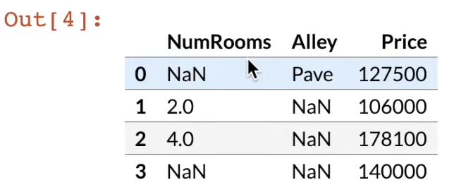
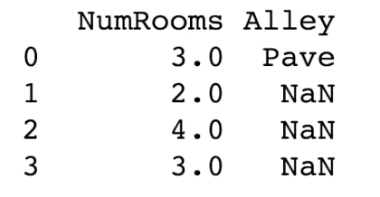
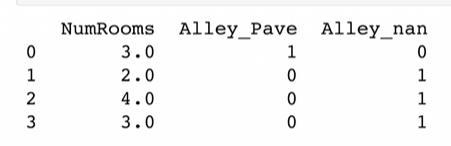
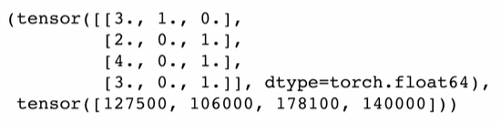
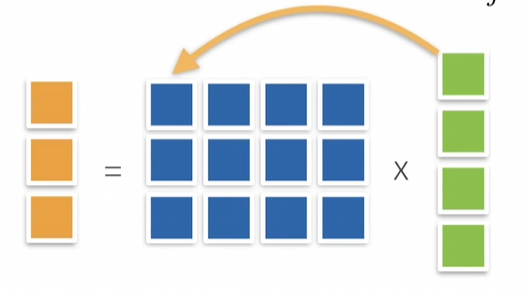

$$
f(x) = x^2 + 3x + 2
$$

[课程链接](https://www.bilibili.com/video/BV1if4y147hS/?spm_id_from=333.999.0.0&vd_source=8924ad59b4f62224f165e16aa3d04f00)

# 01.课程安排

· 深度学习基础——先行神经网络，多层感知机


· 卷积神经网络


· 循环神经网络


· 注意力机制


· 优化算法


· 高性能计算


· 计算机视觉


· 自然语言处理

## 资源

课程主页 https://courses.d2l.ai/zh-v2


教材 https://zh-v2.d2l.ai/


课程论坛 https://discuss.d2l.ai/c/16


pytorch论坛 https://discuss.pytorch.org/

# 02.深度学习介绍

# 03.安装

使用conda/miniconda环境


参考b站默认收藏夹

# 04.数据操作+数据预处理

## 04.1.数据操作

介绍了索引二维矩阵的几种方式

```python
[1,2]
[1,:]
[:,1]
[1:3,1:]#[1:3]左闭右开
[::3,::2]
```

## 04.2.数据操作实现

讲了一些pytorch的内容

```python
import torch
x = torch.arange(12)
x
#tensor([0,1,2,3,4,5,6,7,8,9,10,11])
x.shape()
#torch.Size([12])
x.numel() #number of element 元素数量
#12
X = x.reshape(3,4)
X
"""
tensor([[0,1,2,3],
		[4,5,6,7],
    	[8,9,10,11]])
"""
torch.zeros(2,3,4)#形状为2，3，4值全0的矩阵
torch.ones(2,3,4)#形状为2，3，4值全1的矩阵
torch.tensor([[2,1,4,3],[1,2,3,4],[4,3,2,1]])#创建了一个二维数组 当然也可以创建三维
#算术运算符 +   - * / ** 加 减 乘 除 指数(幂运算)
#所有这些运算都是按元素进行的
torch.exp(x)#对所有元素做指数运算

#也可以把多个张量连结在一起
X = torch.arange(12, dtype=torch.float32).reshape(3,4)
Y = torch.tensor([[2.0,1,4,3],[1,2,3,4],[4,3,2,1]])
torch.cat((X,Y),dim=0)
torch.cat((X,Y),dim=1)

X == Y#生成包含True/False的二元张量

X.sum()
#tensor(66.)
```


广播机制 3x1矩阵和1x2矩阵相加会得到3x2的矩阵


用[-1]可以访问最后一个元素


运行一些操作可能会导致为新结果分配内存

```python
before = id(Y) #id返回值是类似C++中指针一样的东西，表示object在python中唯一的标识号
Y = Y + X
id(Y) == before
#out:False
```


执行原地操作

```python
Z = torch.zeros_like(Y)
print('id(Z):',id(Z))
Z[:] = X + Y
print('id(Z):',id(Z))
"""
out:
id(Z):123456
id(Z):123456
"""
#没有创建一个新的Z

before = id(X)
X += Y
id(X) == before
#out:True
#这里也没有创建一个新的X

#总结：X[:]=X+Y 或 X+=Y 可以减少内存开销
```


转换为 NumPy 张量

```python
A = X.numpy()
B = torch.tensor(A)
type(A),type(B)
#out:numpy.ndarray, torch.Tensor
```


将大小为1的张量转换为Python标量

```python
a = torch.tensor([3.5])
a,a.item(),float(a),int(a)
#out:(tensor([3.5000]), 3.5, 3.5, 3)
```


## 04.3.数据预处理实现

创建一个人工数据集，并存储在csv（逗号分隔值）文件

```python
import os
os.makedirs(os.path.join('..','data'),exist_ok=True)
data_file = os.path.join('..','data','house_tiny.csv')
with open(data_file,'w') as f:
    f.write('NumRomoms,Alley,Price\n') #列名
    f.write('NA,Pave,127500\n') #每行表示一个数据样本
    f.write('2,Pave,106500\n') #每行表示一个数据样本
    f.write('4,Pave,123500\n') #每行表示一个数据样本
    f.write('NA,NA,140000\n') #每行表示一个数据样本
```


从创建的csv文件中加载原始数据

```python
import pandas as pd

data = pd.read_csv(data_file)
data
#out[4]如下图
```




为了处理缺失的数据，典型的方法包括 **插值**和**删除**，这里考虑插值

```python
inputs,outputs = data.iloc[:,0:2],data.iloc[:,2]
#data.iloc[:,0:2] iloc：index location
#把data.iloc的  所有行，第0和第1列(左闭右开)拿出来(也就是NumRooms和Alley两列) 赋值给inputs


#iloc: index location
#上面一行的效果是把第0列和第1列拿出来放到inputs 第2列拿出来放到outputs

inputs = inputs.fillna(inputs.mean())
#将NumRooms列NaN值填成非NaN的值的均值 Alley列是string，没有均值 所以没有变化
print(inputs)
#out[5]如下图   NumRooms列的NaN被插值为非NaN值的平均值了
```




如何处理非数值(此处是字符串)呢

```python
inputs = pd.get_dummies(inputs, dummy_na=True)
print(inpus)
#out6如下图 原本Alley列中有两个值，在新数据中变成了两列，值都为0或1
```




现在`inputs`和`outputs`中所有条目都是数值类型了，它们可以转换为张量格式

```python
import torch

X, y = torch.tensor(inputs.values),touch.tensor(output.values) 
#tensor:张量 关于什么是张量 见《线性代数的本质》
X, y
#out[7]如下图
```




“64位浮点数计算比较慢，通常用32位浮点数”


这是一个样例，展示如何将csv文件读取进来做一定的特征预处理变成pytorch能用的tensor


# 05.线性代数

## 05.1.线性代数

“如果大家没有接触过线性代数应该去稍微学一学”，所以我看完3b1b的《线性代数的本质》之后又回来了

### 5.1.1.标量

”标量就是一个值“

**简单操作**


$$
c = a + b\\
c = a * b\\
c = sina\\
$$


**长度**


$$
|a+b| \le |a| + |b|\\
|a*b| = |a|*|b|
$$


### 5.1.2.向量

”向量就是一行值，可以是行向量或列向量，但是数学上并不区分行和列”

**简单操作**( $α$ 是标量， $a,b$ 是向量)


$$
c = a + b\ where\ c_i = a_i + b_i\\

c = α * b\ where\ c_i = αb_i\\

c = sin\ a\ where\ c_i = sin\ a_i
$$


**长度**

向量长度就是向量的每个元素平方求和再开根号


$$
\|a\|_2 = [\sum_{i=1}^{m}a_i^2]^{1/2}
\|a\| \ge 0||
\|a+b\|\le||a||+\|b\|
\|α*b\| = |α|*\|b\| (此处α是一个标量)
$$


**点乘**


$$
a^Tb = \sum_{i}a_ib_i
$$


**正交**


$$
a^Tb = \sum_{i}a_ib_i=0
$$


### 5.1.3矩阵

**简单操作**


$$
C = A + B\ where\ C_{ij} = A_{ij}+B_{ij}\\
C = α * B\ where\ C_{ij} = αB_{ij}\\
C = sin\ A\ where C_{ij} = sin\ A_{ij}
$$


**乘法**(矩阵乘以向量)


$$
c = Ab\ where\ c_i = \sum_{j}A_{ij}b_j(A是矩阵,bc是向量)
$$





“矩阵乘法直观上来说是在扭曲空间，一个向量通过矩阵乘法变成了另外一个向量”这在《线性代数的本质》中有所解释


**乘法**(矩阵乘以矩阵)


$$
C = AB\ where\ C_{ik} = \sum_{j}A_{ij}B_{jk}
$$


**范数**


$$
c = A\cdot b\ hence\ \|c\| \le \|A\|\cdot \|b\|
$$


取决于如何衡量b和c的长度


**常见范数**

矩阵范数：最小的满足上面公式的值


Frobenius范数：


$$
\|A\|_{Frob} = [\sum_{ij}A_{ij}^2]^{1/2}
$$


**特殊矩阵**

对称和反对称


$$
A_{ij} = A{ji}\ and\ A_{ij}=-A_{ji}
$$


正定“正定矩阵乘以任何一个列向量或者行向量都大于等于0，深度学习不会太多用到正定矩阵”


$$
||x||^2=x^Tx \ge genralizes\ to\ x^TAx \ge 0
$$


还列了**正交矩阵**和**置换矩阵**的概念，不想记了


**特征向量和特征值**


在《线性代数的本质》里有比较直观的理解，这里的定义是“不被矩阵改变方向的向量”


对称矩阵总是可以找到特征向量

## 05.2.线性代数实现

## 05.3.按特定轴求和
