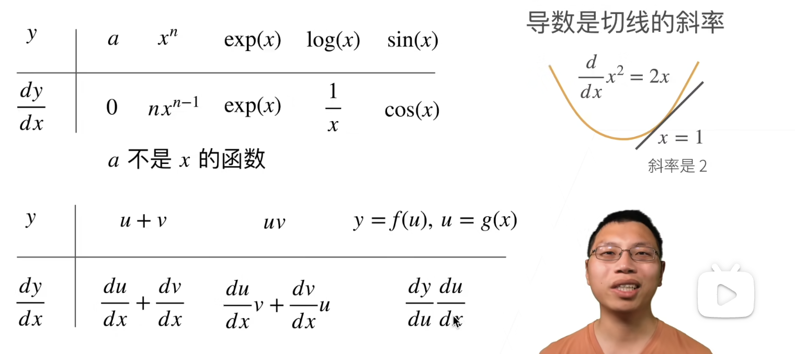
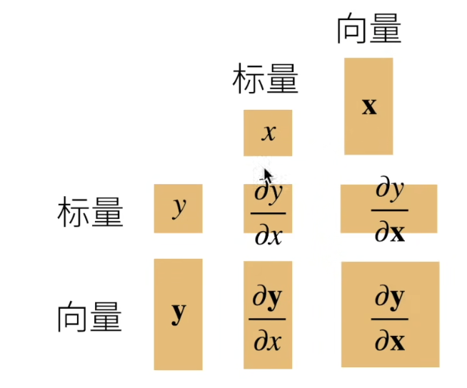
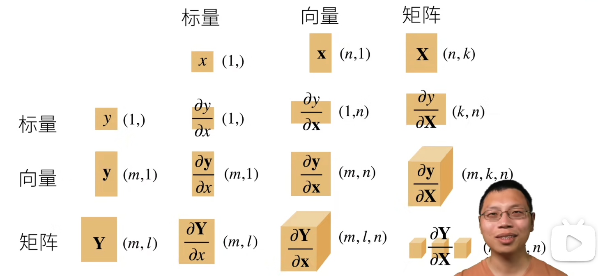

# 05.线性代数

## 05.3.按特定轴求和

对0.5.2.做了补充，都是一些符号上的规则

# 06.矩阵计算

**标量导数**

这里的 $log(x)$ 指的是数学里的 $ln(x)$

**亚导数**：将导数拓展到不可微的函数

**梯度**：将导数拓展到向量

拓展到矩阵

图中的表示了 $y$ 对 $x$ 求导之后，得到的结果的规模，棕色方块可以看出是行向量还是列向量(对于二维的)

右下角括号里被挡住的内容是 $(m,l,k,n)$