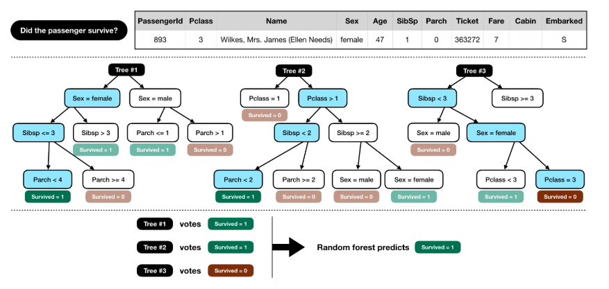
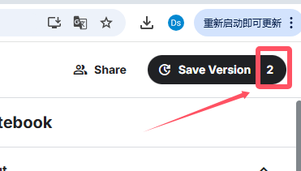
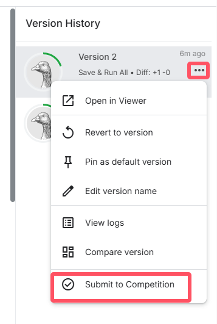

# 0.关于anaconda

在mac上安装很顺利，每次打开都有图形化界面，选择 `jupyter Note book(Web-based)`用起来很方便

但是第一次在windows上安装时只有命令行，输入

```shell
anaconda-navigator
```

之后 出现了上述图形化界面

（另外，`kaggle`页面也提供了类似`jupyter`的代码编辑界面，可以不在本地计算机安装任何东西）

# # 1.新手引导

竞赛题目泰坦尼克号的页面指引我进入[新手引导](https://www.kaggle.com/code/alexisbcook/titanic-tutorial)，此新手引导教会我第一次提交代码。

## 1.1.get started

[竞赛页面](https://www.kaggle.com/c/titanic)点击`data`页面下拉，可以下载数据

`train.csv`包含船上乘客子集的详细信息(准确地说是`891`名乘客的信息，每一行是一位乘客的信息)，是训练数据

`test.csv`相比训练数据隐去了乘客是否存活的信息，需要预测这些乘客是否存活

`gender_submission.csv`是一个示例，举例参赛者应该如何表示自己的预测结果

## 1.2.代码环境

`kaggle`提供了一个网页的代码编写环境

数据位置如下

```python
# This Python 3 environment comes with many helpful analytics libraries installed
# It is defined by the kaggle/python docker image: https://github.com/kaggle/docker-python
# For example, here's several helpful packages to load in 

import numpy as np # linear algebra
import pandas as pd # data processing, CSV file I/O (e.g. pd.read_csv)

# Input data files are available in the "../input/" directory.
# For example, running this (by clicking run or pressing Shift+Enter) will list all files under the input directory

import os
for dirname, _, filenames in os.walk('/kaggle/input'):
    for filename in filenames:
        print(os.path.join(dirname, filename))

# Any results you write to the current directory are saved as output.
```

加载数据

```python
train_data = pd.read_csv("/kaggle/input/titanic/train.csv")
test_data = pd.read_csv("/kaggle/input/titanic/test.csv")
train_data.head()
```

执行这两行之后数据会以表格形式输出（只显示前五行）

`train_data.head()`可以填入参数改变显示的行数

## 1.3.第一次提交

我们的目标是：在`train.csv`中找到模型，帮助我们预测`test.csv`中的乘客是否幸存

有太多数据需要整理这可能会让人感到不知所措，所以我们从简单的模型开始，例如预测女性全部存活

`gender_submission.csv`中的样本提交文件假设所有女性乘客存活(所有男性乘客死亡)

这个猜测合理吗？我们检查一下这个模型在`train.csv`中是否成立

运行以下代码，这计算了女性乘客存活的百分比

```python
women = train_data.loc[train_data.Sex == 'female']["Survived"]
rate_women = sum(women)/len(women)

print("% of women who survived:", rate_women)
```

然后运行以下代码，这计算了女性乘客存活的百分比

```python
men = train_data.loc[train_data.Sex == 'male']["Survived"]
rate_men = sum(men)/len(men)

print("% of men who survived:", rate_men)
```

可以看出船上接近`75%`女性存活下来，而只有`19%`男性存活下来。性别似乎是生存的有力指标，这么看来`gender_submission.csv`中的提交文件作为第一次预测并不是特别糟糕。

但这种预测始终只基于性别这一列信息，考虑更多的列构建更复杂的模型可以得到更好的预测。但由于很难同时考虑多个列(或者考虑许多不同列中的所有可能的模型需要很长时间)，我们将使用机器学习为我们实现自动化。

**第一个机器学习模型**

我们将构建所谓的随机森林模型。该模型由几棵“树”组成（下图中有三棵树，但我们将构建100棵），它们将分别考虑每个乘客的数据，并对个人是否幸存进行投票。然后，随机森林模型做出了一个民主的决定：得票最多的结果获胜！



下面的代码单元格在数据的四个不同列（“Pclass”、“Sex”、“SibSp”和“Parch”）中查找模式。它根据`train.csv`文件中的模式在随机森林模型中构建树，然后在`test.csv`中为乘客生成预测。该代码还将这些新的预测保存在`csv`文件`submission.csv`中。

```python
from sklearn.ensemble import RandomForestClassifier

y = train_data["Survived"]

features = ["Pclass", "Sex", "SibSp", "Parch"]
X = pd.get_dummies(train_data[features])
X_test = pd.get_dummies(test_data[features])

model = RandomForestClassifier(n_estimators=100, max_depth=5, random_state=1)
model.fit(X, y)
predictions = model.predict(X_test)

output = pd.DataFrame({'PassengerId': test_data.PassengerId, 'Survived': predictions})
output.to_csv('submission.csv', index=False)
print("Your submission was successfully saved!")
```

在继续之前，请确保您的笔记本输出了上述相同的消息（您的提交已成功保存！）。
再次强调，如果这段代码对你来说没有意义，不要担心！现在，我们将重点介绍如何生成和提交预测。
准备好后，单击笔记本右上角的“保存版本”按钮。这将生成一个弹出窗口。

确保选择了“保存并全部运行”选项，然后单击“保存”按钮。
这将在笔记本的左下角生成一个窗口。运行完毕后，单击“保存版本”按钮右侧的数字。



这会在屏幕右侧调出一个版本列表。单击最新版本右侧的省略号（…），然后选择在查看器中打开。

单击屏幕顶部的数据选项卡。然后，单击“提交”按钮提交您的结果。



如果要尝试自己的算法并提交，[竞赛页面](https://www.kaggle.com/c/titanic)`Overview`页面下拉可以找到**Submission File Format**，这里说明了提交文件的格式  

例如这里举例的竞赛页面给出了每列的列名，括号中有一些补充描述

+ PassengerId（任意顺序）
+ Survived（包含你的二元预测：1代表存活，0代表遇难）

不过，好像没有指明文件名？教程中的文件名是`submission.csv`，或许可以试一下使用其它文件名会发生什么。

# 2.实战

从李沐教程第8章开始有具体的模型，应该会根据具体的模型选择对应的竞赛进行实战。

## 2.1.线性回归

[房价预测](https://www.kaggle.com/competitions/house-prices-advanced-regression-techniques)
