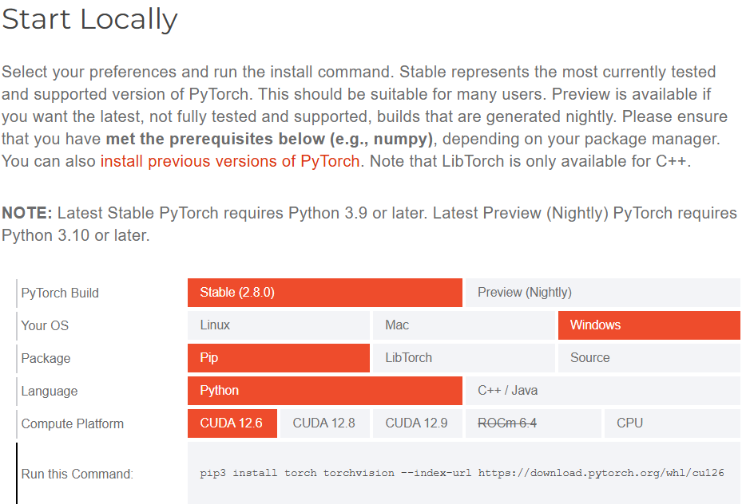

# 1.仓库内容

1.`动手学习深度学习` 李沐老师的课程 视频在b站  

2.`实战练习` 主要是kaggle网站上的竞赛实战记录，也可能包含一些其它的实战练习

3.`实用的机器学习` 胡老师的课程，看起来是无限搁置了  

4.`cpp_py交互` 属于TODO项

5.`python相关` 目前主要是`pandas`库的学习和练习

# 2.关于anaconda

在mac上安装很顺利，每次打开都有图形化界面，选择 `jupyter Note book(Web-based)`用起来很方便

但是第一次在windows上安装时只有命令行，输入

```shell
anaconda-navigator
```

之后 出现了上述图形化界面

（另外，`kaggle`页面也提供了类似`jupyter`的代码编辑界面，可以不在本地计算机安装任何东西）


画图时jupyter内核经常崩溃，其原因是pytorch使用的库文件与其它库文件有冲突，下面是临时的解决方法，其告诉系统允许库的重复加载

```python
import os
os.environ["KMP_DUPLICATE_LIB_OK"]="TRUE"
```


# 3.daily

## 2025.10.9



把anaconda里的pytorch从**CPU-only**版本换成**GPU**版本，在[pytorch官网](https://pytorch.org/get-started/locally/)可以获得下载指令，CUDA12.6对应的指令是

```shell
pip3 install torch torchvision --index-url https://download.pytorch.org/whl/cu126
```

