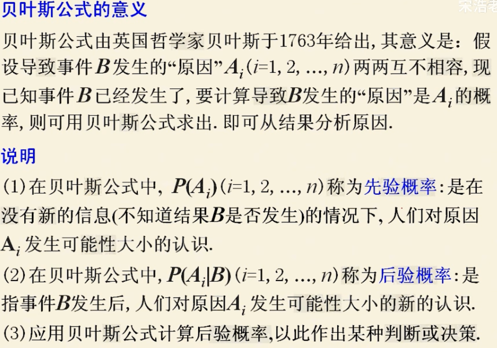
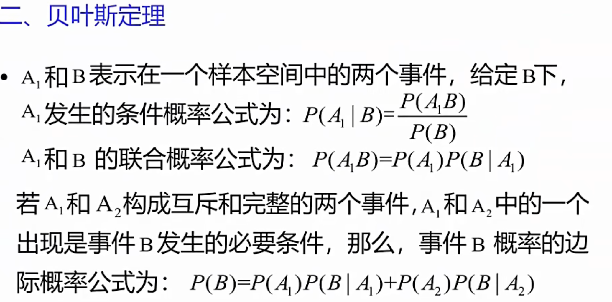

[视频链接](https://www.bilibili.com/video/BV1Gw4m1i7ys/?spm_id_from=333.1007.top_right_bar_window_custom_collection.content.click&vd_source=8924ad59b4f62224f165e16aa3d04f00)

# 1.第一课 机器学习导论
"机器学习是能够自动从数据经验中学习，去提高系统能力的计算机系统。经验大多数情况都是数据"

有监督学习：训练数据是(input,output)数据对，包括分类任务和回归任务

无监督学习：聚类、降维。无监督学习是一个定义得没有那么清晰的问题，相比监督学习更难一些

强化学习：“严格来说算是监督学习”

泛化（Generalization）能力：模型在测试集上的表现好坏

训练数据-测试数据-真实数据，三部分数据需要对齐

第一次课的作业见压缩文件hw1.zip
# 2.第二课 ML流程&推荐系统&度量方式(Metrics)
尽量用监督学习而不是非监督学习

一个度量好坏的方式是“准确性”

但是在癌症检测的模型中，如果模型无脑将结果预测为“不是癌症”也会有99.9%的准确性。由此来看不同的错误的重要程度是不同的。

“炸弹检测”或“垃圾邮件检测”的可以使用如下度量方式

|   |Spam(label)|Ham(label)|
|---|---        |---|
|Spam(predict)  |TP|FP|
|Ham(predict)   |FN|TN|

TP：被预测为垃圾邮件且正确的数量

FP：被预测为垃圾邮件但错误的数量

FN：被预测为正常邮件但错误的数量

TN：被预测为正常邮件且正确的数量

$Precision = \frac{TP}{TP+FP}$ 预测结果为true的数据中，实际为true的概率

$Recall = \frac{TP}{TP+FN}$ 所有为true的数据中，被正确预测的概率

“垃圾邮件检测”中 Precision更重要

“炸弹检测”中Recall更重要

accuracy（准确性）度量方式更适用于**分类任务**，即预测结果要么正确要么错误。

而在**回归任务**中，例如根据图片预测人的年龄，将30岁的人预测为29岁还是预测为5岁虽然都是“错误”但是错误程度是不同的。

这时候另一个度量方式Mean Squared Error(MSE 平方差的均值)就更适合了

$MSE(f,t) =\frac{1}{n}\sum{i=1}^{n}(y_i-f(x_i,t))^2$

MSE的问题是，当预测值值与实际值相差过大对结果影响更大因此有了
Mean Average Error(MEA 绝对值之差的均值)

$MEA(f,t) =\frac{1}{n}\sum_{i=1}^{n}|y_i-f(x_i,t)|$

但这种方式不好优化，用得更多的还是MSE。

另一个评价指标是cost 包括以下几点

1.速度怎样（指完成一次检测的速度）？比如在高铁人脸检测的场景中：一个算法的延迟是几百或几十ms这很好，但另一个算法精度高5%但是预测时间是30s或60s，那就很糟糕。

2.内存开销 嵌入式或手机中跑一个模型跟在服务器中是不一样的

3.CPU vs GPU

4.根据数据规模大小选择不同的模型

总结：度量方式包括accuracy、Precision、Recall、MSE、MEA、cost

# 3.第三课贝叶斯决策


## 3.1贝叶斯决策理论 Bayesian Decision Theory
问题定义：

x：feature of sample

y：state of the nature，often is class label


条件概率： $P(A|B) = P(A,B) / P(B)$

$P(A|B)$：B已经发生的条件下A发生的概率

$P(A,B)$：AB同时发生的概率

当且仅当$P(A,B) = P(A)P(B)$时AB两事件**独立**

贝叶斯定律的内容：

$P(A|B)=\frac{P(B|A)P(A)}{P(B)}$

此公式可以由条件概率如下推导得到：

1. $P(A|B) = P(A,B) / P(B)$ 就是上面的条件概率

2. $P(A,B)=P(B|A)P(A)$ 想一想这个等式是成立的，“A发生的概率”乘以“在A发生的条件下B发生的概率”自然就得到了“AB同时发生的概率”。在我的理解里，条件是概率由本式推导得出的更符合直觉。

将2式带入1式就得到了贝叶斯定律

prior probability（先验概率）：

比如对鱼进行分类，在没有任何数据的情况下拿到一条鱼可能认为它是sea bass鱼和salman鱼的概率各50%（均匀先验 uniform priors），但如果对大自然做了一些统计，这个值大概率会变化。

又例如在炸弹检测或癌症检测中，炸弹出现的概率和癌症出现的概率可能都在千分之一左右，这时均匀先验显然是不合适的。

Likelihood：到底什么是likelihood呢

胡老师的原话是“P(x|y1)，P(x|y2)就是likelihood。 given label，feature的概率是多少”（y1，y2是鱼的label，即鱼是属于sea bass还是属于salman）

我又问了问AI
```
可以试图用一些数学语言向我解释likelihood（似然）吗？

...
数学形式化地,likelihood 可以定义为:
L(H|D) = P(D|H)
其中 P(D|H) 表示在模型 H 为真的情况下,观测到数据 D 的概率。这个概率就是 likelihood。
举个例子,假设我们有一枚硬币,我们的模型 H 是"这枚硬币是均匀的"。我们观测到连续抛掷 10 次出现 6 次正面,4 次反面。在这种情况下,likelihood 就是在"硬币是均匀的"这个假设下,观测到这样的数据结果的概率。
... 


我觉得比较有意义的一句话是最后一句：【likelihood就是在“硬币是均匀的”这个假设下，观测到这样的数据结果的概率】
```

Maximum likelihood decision（极大似然估计）：

Decide $y_1$ if $P(x|y_1) > p(x|y_2)$ otherwise $y_2$


Posterior（后验概率）：

已有贝叶斯公式： $P(y_i|x)=\frac{P(x|y_i)P(y_i)}{P(x)}$

上式中： $P(x)=\sum_{i=1}^{k}P(x|y_i)P(y_i)$

**Posterior** = (**Likelihood** $\times$ **Prior**) / Evidence

$P(y_i|x)=P(x|y_i) \times P(y_i) / P(x)$

Evidence $P(x)$可以认为是一个常数，为了使后验概率之和为1


Optimal bayes Decision Rule（最优贝叶斯决策）

Decide $y_1$ if $P(y_1|x) > p(y_2|x)$ otherwise $y_2$

推广：
```
featrue往往不止一个(假设p个)
分类也不止两类(假设有c类)
各个错误的重要程度也是不同的
```

Bayesian Risk（贝叶斯风险决策）

$E_{ij}=E(\hat{y_i}|y_j)$：把 $y_j$ 预测成 $y_i$ 的代价

$R(\hat{y_1}|x)=E_{11}P(y_1|x)+E_{12}P(y_2|x)=E_{12}P(y_2|x)$

$R(\hat{y_2}|x)=E_{21}P(y_1|x)+E_{22}P(y_2|x)=E_{21}P(y_1|x)$

Decide $y_1$ if $R(\hat{y_1}|x) < R(\hat{y_2}|x)$,otherwise $y_2$

if $E_{12} = E_{21}$ then this is Posterior decision rule.

Decision Regions and Surfaces（特征边界）

先验概率需要估计：一般用训练集中的频率代替先验概率。

似然概率也需要估计：如果feature在训练集中出现过，可以直接从训练集中计算出来。如果不在训练集中出现过，似乎就没办法了。

总之目前看来需要非常多的数据，才能预估出一个有效的概率。


## 3.2朴素贝叶斯分类器 Naive Bayes Classifier
往往需要从training sample中预估概率，可是当space feature太大时，需要的数据量就会爆增。此时可以提出一些更强的假设来把问题简化。

$x = (x_1,...x_p)$ ，目标是预测y的类别，想要找到一个y值使得 $P(y|x)=P(y|x_1,...x_p)$ 最大。（即确定分类）

根据上面的贝叶斯公式， $P(y|x_1,...x_p)=\frac{P(x_1,...x_p|y)P(y)}{P(x_1,...x_p)}$

其中分母看作常数，分子中的 $P(y)$ 可以根据训练样本估计，但是
 $P(x_1,...x_p|y)$ 的值不好估计

假设feature之间相互独立则有 $P(x_1,...x_p|y)=P(x_1|y)···P(x_p|y)$
。等式右边是p项相乘，每一项的值都很容易预估出来。但是这样的问题是：

1.精度问题，很多小数相乘很可能导致浮点溢出，因此可以取一个log把乘变成加

2.如果有一项0，则最终结果一定是0。所以需要平滑处理 $P(x|y_i)=\frac{|x_ik|+1}{N_{y_k}+K}$

(K是label的数量)
