# 05.线性代数

## 05.3.按特定轴求和

对0.5.2.做了补充，都是一些符号上的规则

# 06.矩阵计算

[后面弹幕推荐的一篇教程，什么是分子分母布局](https://zhuanlan.zhihu.com/p/263777564)

**标量导数**

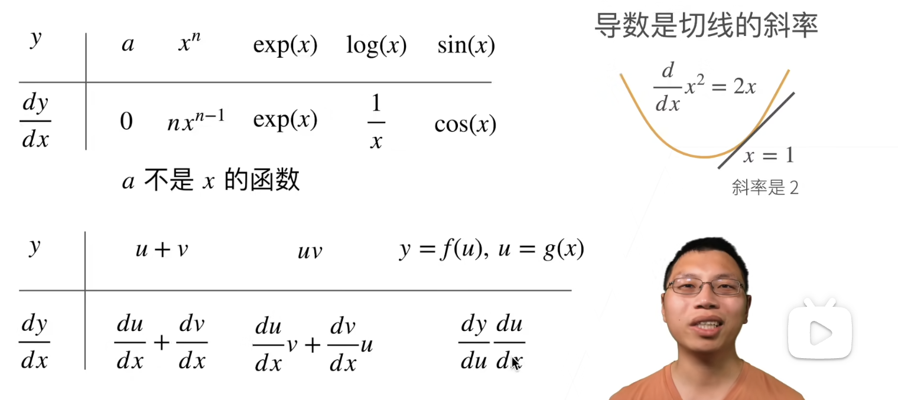

这里的 $log(x)$ 指的是数学里的 $ln(x)$

**亚导数**：将导数拓展到不可微的函数

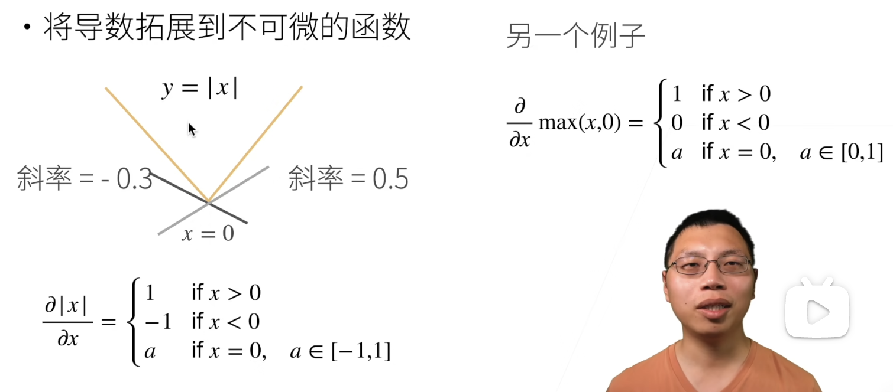

**梯度**：将导数拓展到向量

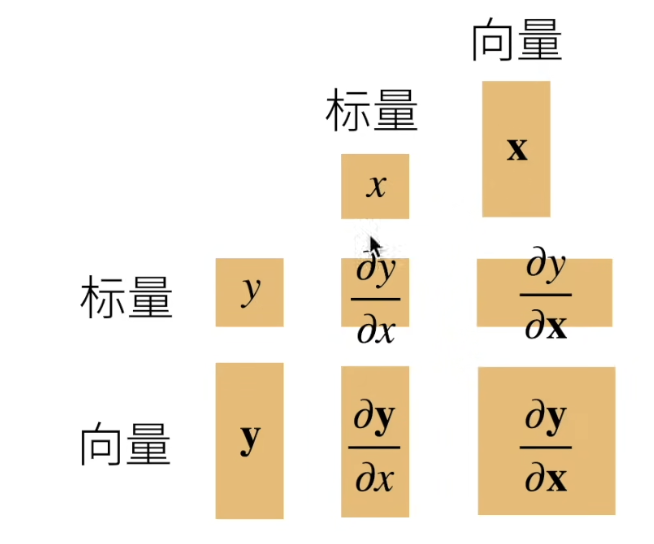

拓展到矩阵

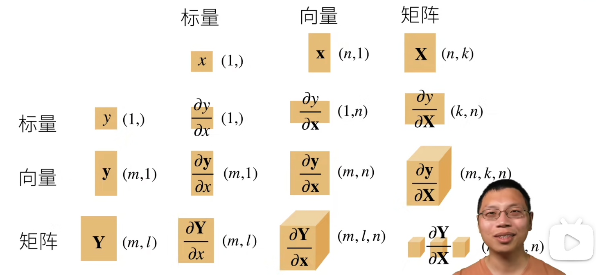

图中的表示了 $y$ 对 $x$ 求导之后，得到的结果的规模，棕色方块可以看出是行向量还是列向量(对于二维的)

右下角括号里被挡住的内容是 $(m,l,k,n)$

# 07.自动求导

## 07.1.自动求导

内积运算: $<a,b> = a \cdot b = a_1b_1+a_2b_2 +...+a_bb_n$

若有两列向量 $x y$ ,其内积可以表示成 $x^T \times y$ (数学中的一维向量一般认为是列向量)

 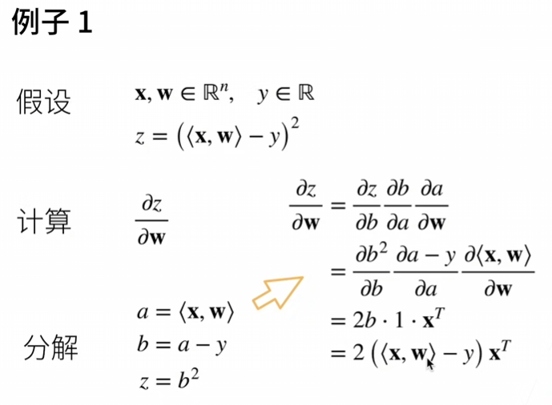

上图中 $x,w$ 是长为n的向量,y是标量,下面这个等式(上图中的一部分)为什么成立呢?

$$
\frac{d<x,w>}{dw} = x^T
$$

因为 $d<x,w>=x^Tw$ , $x^Tw$ 对 $w$ 求导,把 $x^T$ 看成常数项,结果自然就是 $x^T$

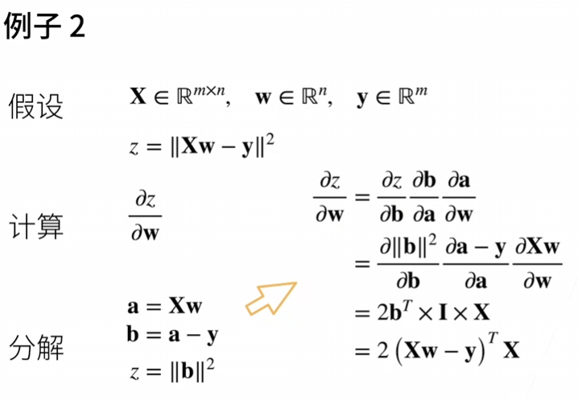

我不太理解为什么b的第二范数的平方对b求导结果是 $2b^T$  

弹幕推荐了一篇教程  

[什么是分子分母布局](https://zhuanlan.zhihu.com/p/263777564)

**自动求导**计算一个函数在指定值上的导数，它有别于**符号求导**和**数值求导**

## 07.2.自动求导实现

见 `自动求导实现.ipynb`

# 08.线性回归

[视频链接](https://www.bilibili.com/video/BV1PX4y1g7KC/?spm_id_from=333.999.0.0&vd_source=8924ad59b4f62224f165e16aa3d04f00)

 “线性回归是机器学习最基础的一个模型，也是我们理解之后所有深度学习模型的基础”

## 08.1.线性回归

经典的房价预测例子。立马让我想到本科期间胡隽老师的数学建模选修课，是知识浓度很高的回忆

**衡量预估质量**

假设 $y$ 是真实值， $\hat{y}$ 是预估值

平方损失： $l(y, \hat{y})=\frac{1}{2}(y- \hat{y})^2$ 

**训练数据**

收集一些数据点来决定参数值（权重和偏差），例如过去6个月卖的房子

这杯称之为训练数据

通常越多越好

假设有n个样本，记

$X = [x_1,x_2,...,x_n]^T$ $y = [y_1,y_2,...,y_n]^T$

**参数学习**

训练损失：

$l(\mathbf{X,y,w},b)=\frac{1}{2n} \sum_{i=1}^{n}(y_i- \langle \mathbf{x_i}, \mathbf{w} \rangle -b)^2 = \frac{1}{2n}||\mathbf{y-Xw}-b||^2$

最小化损失来学习参数：

$\mathbf{w^*,b^*}=arg \underset{\mathbf{w},b}{min}l(\mathbf{X,y,w,}b)$

**显式解**

将偏差加入权重（将一列全 $1$ 的特征加进 $X$ ，再把偏差 $b$ 放到 $w$ 的最后面）

表达式就没有符号 $b$ 了，然后求导等于0可以得到解

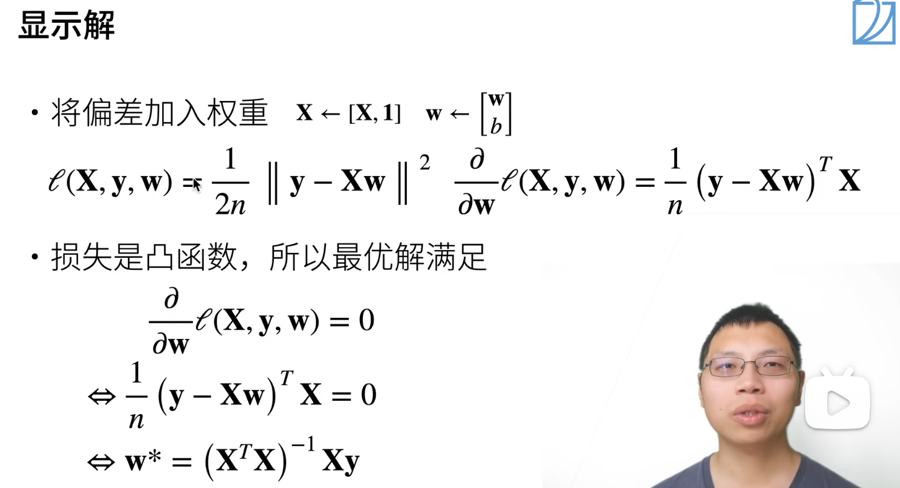

**总结**

线性回归是对n维输入的加权，外加偏差

使用平方损失来衡量预测值和真实值的差异

线性回归有显示解

线性回归可以看做是单层的神经网络

"机器学习通常是用来求解 NP-complete问题，有显式解的模型过于简单"

“解释线性回归是因为线性回归可以看作一个单层的神经网络”

## 08.2.基础优化算法

**1.梯度下降**

“梯度不能太大也不能太小”

**2.小批量随机梯度下降**

“批量不能太大也不能太小”

每一次计算梯度要对整个损失函数求导，损失函数是所有样本的平均损失。这意味着每求一次梯度要把整个样本重新算一遍，计算代价大。

损失是各个样本损失的平均，可以随机采样个样本 $i_1,i_2,...,i_b$ 来近似损失

b是批量大小，另一个重要的超参数

**3.总结**

梯度下降通过不断沿着梯度**反方向**更新参数求解

**小批量随机梯度下降**是深度学习默认的求解算法

两个重要的超参数是**批量大小**和**学习率**

## 08.3.线性回归的从零开始实现

“不使用任何深度学习框架提供的计算，而且只使用最简单的在tensor上面的计算来实现所有讲过的算法和一些技术细节”

用到了`d2l`库，可以把[github仓库](https://github.com/d2l-ai/d2l-zh/tree/master)中的`d2l`文件夹和`.ipynb`文件放到一起

代码见文件`08.3.线性回归的从零开始实现.ipynb`

总之实现了一个通过`X`预测`y`的模型`y = Xw + b`，`X`是二维向量，`y`是标量。

定义了模型、损失函数、优化算法之后使用梯度下降完成了训练。

我唯一不是非常清晰的部分是求梯度（求导的部分），但是我发现我不需要太清楚具体怎么求导，因为这一部分由`pytorch`完成

## 08.4.线性回归的简洁实现

`08.4.线性回归的简洁实现.ipynb`

从这里开始我接触了一些kaggle上的练习，见`kaggle练习.md`

# 09.Softmax回归+损失函数+图片分类数据集

> logistic回归可以看作softmax回归的一个特例

[视频链接](https://www.bilibili.com/video/BV1K64y1Q7wu?spm_id_from=333.788.recommend_more_video.0&vd_source=8924ad59b4f62224f165e16aa3d04f00)

## 09.1.Softmax 回归

**分类vs回归**

+ **回归**估计一个连续值

+ **分类**预测一个离散类别

`softmax回归`虽然名字里面带了“回归”，但其实是一个分类问题

**kaggle上的分类问题**

+ 将人类蛋白质显微镜图片分成28类

+ 将恶意软件分成9个类别

+ 将恶意的wikipedia评论分成7类

**从回归到多类分类**

回归：

+ 单连续数值输出

+ 输出区间是自然区间

+ 跟真实值的区别作为损失

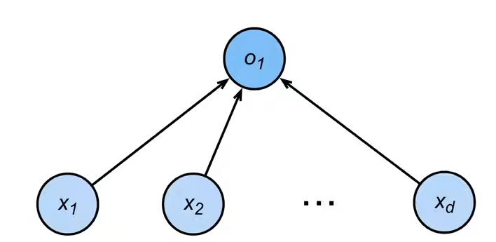

分类：

+ 通常多个输出

+ 输出`i`是预测为第`i`类的置信度

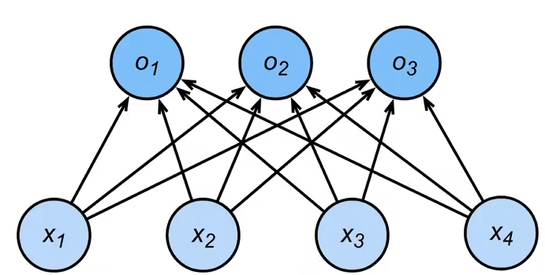

**从回归到多类分类 - 均方损失**

+ 对类别进行一位有效编码     

$y = [y_1,y_2,...y_n]^T$

$$
y_i = 
\begin{cases}  
1 \quad if \quad i=y \\
0 \quad otherwise
\end{cases}
$$

+ 使用均方损失训练

+ 最大值最为预测$\hat{y} =\underset{i}{argmax} o_i$

 **从回归到多类分类 - 校验比例**

+ 输出匹配概率（非负，和为1）

> 将softmax作用在o上面得到 $\hat{y}$ ，它也是一个长为n的向量，但是每个元素非负，且和为1

$\hat{y} = softmax(o)$

> 下面是softmax具体对每个元素的操作，就是每个元素做指数再除以所有元素做指数的和

$$
\hat{y_i}=\frac{exp(o_i)}{\sum_{1}^{k}exp(o_k)}
$$

+ 概率 $y$和 $\hat{y}$ 的区别作 为损失（前者是真实概率，后者是预测概率）

**Softmax和交叉熵损失**

+ 交叉熵常用来衡量两个概率的区别 $H(p,q) = \sum_{i}{-p_ilog(q_i)}$
+ 将它作为损失 $l(y,\hat{y}=-\sum_{i}{y_ilog\hat{y_i}}=-log\hat{y}_y)$

> 上面是因为 真实概率y向量的元素只有一个1，其余是0，预测概率 $\hat{y}$ 的元素全是0到1的值

+ 损失的梯度是真实概率和预测概率的区别 $softmax(o)_i-y_i$

## 09.2.损失函数

损失函数用来衡量预测值和真实值之间的区别，

+ 均方损失     `L2 Loss`    $l(y, y^{'})=\frac{1}{2}(y-y^{'})^2$
+ 绝对值损失 `L1 Loss`    $l(y, y^{'})= |y-y^{'}|$
+ `Huber's Robust Loss`结合了前面两者的优点：当预测值和真实值差的绝对值大于1时使用`绝对值损失 - 1/2`否则使用`均方损失`

> 这里我突然明白了为什么更新参数的时候都是减去梯度乘以学习率，因为最终目的是让梯度为0

## 09.3.图片分类数据集

见`09.3.图片分类数据集.ipynb`

## 09.4.Softmax 回归从零开始实现

见`09.4.Softmax 回归从零开始实现.ipynb`

## 09.5.Softmax 回归简洁实现

见`09.5.Softmax 回归简洁实现.ipynb`

# 10.多层感知机 + 代码实现

[视频链接](https://www.bilibili.com/video/BV1hh411U7gn?spm_id_from=333.788.videopod.episodes&vd_source=8924ad59b4f62224f165e16aa3d04f00)

## 10.1.感知机

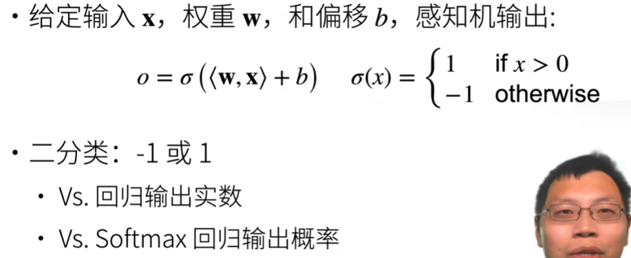

**训练感知机的伪代码**

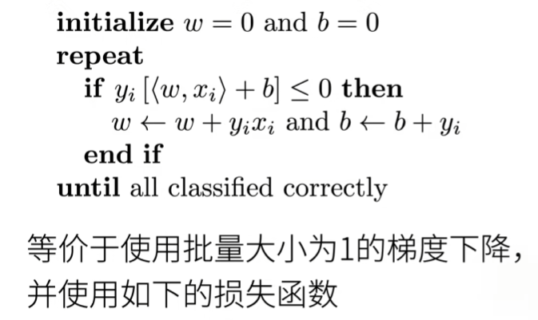

$l(y,x,w) = max(0,-y<w,x>)$  

上面这个公式没有b，应该是做了 $w=(w,b) x=(x,1)$ 的向量化处理  

如果分类正确，则损失为0  

其对`w`和`b`的偏导分别就是上图的 $y_ix_i$ 和 $y_i$  

**XOR问题**  

单层感知机不能拟合`XOR`函数，它只能产生线性分割面  

**总结**

+ 感知机是一个二分类模型，是最早的AI模型之一
+ 它的求解算法等价于使用批量大小为1的梯度下降
+ 它不能拟合XOR函数，导致第一次AI寒冬

## 10.2.多层感知机

多层感知机可以拟合XOR函数  

相比单层感知机，多层感知机可以加入若干**隐藏层**，也可以解决**多分类**问题

如果隐藏层没有**激活函数**，无论多少层的感知机都相当于一个单层感知机，激活函数的目的是引入**非线性性**

**Sigmoid激活函数**，将输入投影到`(0,1)`  

$$
sigmoid(x) = \frac{1}{1+exp(-x)}
$$

**Tanh激活函数**，将输入投影到`(-1,1)`  

$$
tanh(x) = \frac{1-exp(-2x)}{1+exp(-2x)}
$$

**ReLU激活函数**，最常用的激活函数，没有指数运算计算成本小  

$$
ReLU(x) = max(x, 0)
$$

## 10.3.代码实现

`10.3.多层感知机的代码实现.ipynb`

# 11.模型选择 + 过拟合欠拟合

## 11.1模型选择

主要讲了一个`k折交叉验证`，在数据集不大时可以使用。主要做法是  

+ 将训练数据分割成K块 
+ For i = 1, ..., K 使用第i块作为验证数据集，其余的作为训练数据集
+ 报告k个验证集误差的平均

##  11.2.过拟合和欠拟合

大概的指导思想是：对于简单的数据要用简单的模型，对于复杂的数据要用复杂的模型

## 11.3.代码   

演示了过拟合欠拟合的现象，就不记了

# 12.权重衰退

[视频链接][https://www.bilibili.com/video/BV1UK4y1o7dy?spm_id_from=333.788.videopod.episodes&vd_source=8924ad59b4f62224f165e16aa3d04f00]

## 12.1.权重衰退

`权重衰退(weight_decay)`是最常见的处理过拟合的一种方法，通过限制权重`w`值的范围来实现。

**使用平方和作为硬性限制**

+ 通过限制参数值的选择范围来控制模型容量(公式符号似乎不标准，总之是在限制参数的大小)

 $||w||^2 \le \theta$

+ 通常不限制b
+ 小的 $\theta$ 意味着更强的正则项

**使用平方和作为柔性限制**

+ 在原损失函数后面加上罚函数，变为以下形式
+  $\lambda$ 是新加入的超参数

$$
l(w,b) + \frac{\lambda}{2}||w||^2
$$

**参数更新法则**

+ 计算梯度

$$
\frac{\partial}{\partial w}(l(w,b)+\frac{\lambda}{2}||w||^2)=\frac{\partial l(w,b)}{\partial w}+\lambda w
$$

+ 时间t更新参数 $w_{t+1}=w_t-\eta\frac{\partial}{\partial w}$ (上式等式右边就是这里的 $\frac{\partial}{\partial w}$ ，代入得下式)

$$
W_{t+1} = (1-\eta \lambda)W_t-\eta \frac{\partial l(w_t,b_t)}{\partial w_t}
$$

通常 $\eta \lambda < 1$ ，在深度学习中通常叫做权重衰退。越靠近最优解，罚函数对参数更新幅度的影响越小

## 12.2.代码实现

短时间内应该不会用到 先不管

# 13.丢弃法

[视频链接](https://www.bilibili.com/video/BV1Y5411c7aY?spm_id_from=333.788.recommend_more_video.0&vd_source=8924ad59b4f62224f165e16aa3d04f00)

## 13.1.丢弃法

丢弃法在层之间加入噪音  

“正则使得权重的范围不要过大，可以避免一定的过拟合。丢弃法是一个正则” 

**无差别加入噪音**

+  $x$ 是一层的输出，加入噪音得到 $x'$，我们希望期望不变，即 $E[x']=E[x]$
+ 丢弃法对每个元素进行如下扰动（引入了一个概率 `p`）

$$
x_i^{'}=
\begin{cases}
0               & \text{with probablity p }\\
\frac{x_i}{1-p} & \text{otherwise }
\end{cases}
$$

**使用丢弃法**

+ 通常将丢弃法作用在隐藏全连接层的输出上 

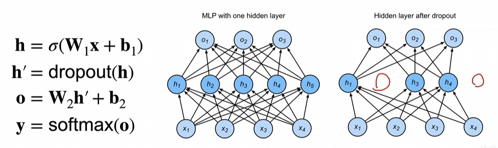

**推理(预测)中的丢弃法**

+ 正则项只在训练中使用：他们影响模型参数的更新
+ 在推理过程中，丢弃法直接返回输入
  + 这样也能保证确定性的输出

$$
h=dropout(h)
$$

  

## 13.2.代码实现

`13.2.丢弃法代码实现`

# 14.数值稳定性

[视频链接](https://www.bilibili.com/video/BV1u64y1i75a?spm_id_from=333.788.player.player_end_recommend_autoplay&vd_source=8924ad59b4f62224f165e16aa3d04f00)  

复习了一下[矩阵求导](https://zhuanlan.zhihu.com/p/263777564)

## 14.1.数值稳定性

**例子：MLP**  

$$
f_t(h^{t-1})=\sigma(W^th^{t-1}) \qquad  \sigma \text{是激活函数}
$$

$$
\frac{\partial h^t}{\partial h^{t-1}}=diag(\sigma^{'}(W^th^{t-1}))(W^t)^T \qquad \sigma^{'}\text{是}\sigma \text{的导数函数}
$$

$ \sigma $ 函数是前文提到过的`Relu`，函数形式非常简单，导函数 $ \sigma^{'} $ 的形式也很简单  

`diag`把向量变为一个对角矩阵，例如一个向量是`[1,2,3]`经过`diag`运算后得到一个3x3的矩阵，主对角线元素分别是`1,2,3`其余元素是0  

