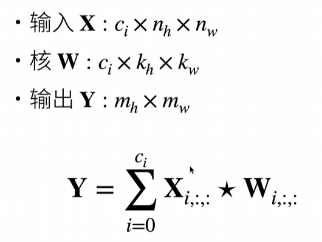

#  19.卷积层

[教程链接](https://www.bilibili.com/video/BV1L64y1m7Nh/?spm_id_from=333.1387.upload.video_card.click&vd_source=8924ad59b4f62224f165e16aa3d04f00)

不要太纠结视频里面的数学式，理解两个二维矩阵如何进行**卷积运算**或**交叉相关运算**即可

## 19.1.从全连接到卷积

$$
h_{i,j}=\sum_{k,l}W_{i,j,k,l}x_{k,l}=\sum_{a,b}v_{i,j,a,b}x_{i+a,j+b}
$$

实际上这个公式描述的就是二维图片和二维卷积核的卷积操作（[什么是卷积](https://www.bilibili.com/video/BV1VV411478E/?spm_id_from=333.788.top_right_bar_window_custom_collection.content.click&vd_source=8924ad59b4f62224f165e16aa3d04f00)）  

其中`v`是卷积核矩阵，`x`是图片矩阵  

**原则1 平移不变性**

+ x的平移会导致h的平移 


$$
h_{i,j}=\sum_{a,b}^{}v_{i,j,a,b}x_{i+a,j+b}
$$


+ v不应该依赖于(i,j) （也就是无论i,j如何变化，v都是那个v）
+ 解决方案: $v_{i,j,a,b}=v_{a,b}$


$$
h_{i,j}=\sum_{a,b}^{}v_{a,b}x_{i+a,j+b}
$$

​	

这就是2维~~卷积~~交叉相关

**原则2 局部性**

换了一种形式，当 $|a|,|b|>\Delta$ 时，使得 $v_{a,b=0}$


$$
h_{i,j}=\sum_{a=-\Delta}^{\Delta}\sum_{b=-\Delta}^{\Delta}v_{a,b}x_{i+a,j+b}
$$

## 19.2.卷积层

**交叉相关VS卷积**

区别就是在索引卷积核时，两者索引顺序是对称的，为了计算方便使用前者  

它们在实际使用中没有区别

**一维和三维交叉计算**

这里主要关注的是二维计算，一维和三维的计算也是有的  

一维：文本、语言、时序序列


$$
y_i=\sum_{a=1}^{h}w_ax_{i+a}
$$


三维：视频、医学图像、气象地图


$$
y_{i,j,k}=\sum_{a=1}^{h}\sum_{b=1}^{w}\sum_{c=1}^{d}w_{a,b,c}x_{i+a,j+b,k+c}
$$

**总结**

+ 卷积层将输入和核矩阵进行交叉相关，加上偏移后得到输出
+ 核矩阵和偏移是可学习的参数
+ 核矩阵的大小是超参数

## 19.3.代码

见`19.3.卷积层代码`  

这里有裸写梯度下降  (手动访问了`weight`和`grad`)

# 20.卷积层里的填充和步幅

[链接](https://www.bilibili.com/video/BV1Th411U7UN?spm_id_from=333.788.recommend_more_video.0&vd_source=8924ad59b4f62224f165e16aa3d04f00)  

## 20.1.填充和步幅

按照之前的做法，图像与卷积核进行运算之后会变小。如果不想让它变小呢？  

**填充**  

在输入的周围添加额外的行/列

**步幅**  

步幅是指行/列的滑动步长

**总结**

+ 填充和步幅是卷积层的超参数
+ 填充在输入周围添加额外的行/列，来控制输出形状的减少量
+ 步幅是每次滑动核窗口时的行/列的步长，可以成倍地减少输出形状

## 20.2.代码

`20.2.卷积层里的填充和步幅.ipynb`

`nn.Conv2d`有一个参数`padding`

当填写`padding=1`意为在上下各加一行，左右各加一列，等同于填写`padding=(1,1)`

如果卷积核的行数或列数不为偶数的话，使用这个`padding`参数就无法使输入输出矩阵大小保持不变了

# 21.卷积层里的多输入多输出通道

[链接](https://www.bilibili.com/video/BV1MB4y1F7of/?spm_id_from=333.1387.upload.video_card.click&vd_source=8924ad59b4f62224f165e16aa3d04f00)

## 21.1.多输入输出通道

前面用到的代码   `conv2d = nn.Conv2d(1, 1, kernel_size=(1,2), bias=False)`   这里的前两个参数就分别是 输入，输出通道数  

彩色图像可能有RGB三个通道（大小为200x200的图片，矩阵大小是200x200x3）  

下图例子输入通道数为2，输出通道数为1  




多输入通道相比单输入通道，**输入**和**卷积核**多了一个输入通道数维度 $c_i$  

两个输入和两个卷积核**分别运算**得到两个矩阵，再把两个矩阵加起来得到最终的输出结果。  

（注意这里二维输入矩阵的数量等于二维卷积核的数量）

这个例子里二维矩阵(输入/卷积核)的数量2，实际上数量可以更多。若干个二维矩阵就是三维矩阵啦，因此这里有一个**三维输入矩阵**和一个**三维卷积核**


多输出通道相比单输出通道，**卷积核**和**输出**多了一个输出通道数维度 $c_o$  

上面提到了**三维卷积核**，一个三维卷积核对应一个输出通道，有多少个三维卷积核就有多少个输出通道  

所以多输出通道时有**四维卷积核**


相当于输出形状为 $n_hn_w \times c_i$ ，权重为形状 $c_i \times c_o$ 的全连接层

**总结**

+ 输出通道数是卷积层的超参数
+ 每个输入通道有独立的二维卷积核，所有通道结果相加得到一个输出通道结果
+ 每个输出通道有独立的三维卷积核

## 21.2.代码实现

见`21.2.卷积层里的多输入多输出通道代码实现`  

这里写一下 `zip` 函数的作用及用法

```python
for item in zip(para1,para2,para3,...):
    do something
```

`zip`返回一个可迭代对象，其元素数量为各参数的第一维大小，若各参数第一维大小不同则取最小值

其中`item`是一个tuple类型，其长度为参数个数。

`items`中各元素由各参数第一维的各个元素拼接而成

# 22.池化层

[课程链接](https://www.bilibili.com/video/BV1EV411j7nX/?spm_id_from=333.1387.upload.video_card.click&vd_source=8924ad59b4f62224f165e16aa3d04f00)

池化过程也是**输入**和**核**做运算的过程  

池化层一般步长等于宽度

## 22.1.池化层

一般是先有卷积输出的结果，然后再对这个结果做池化

+ 池化层返回窗口中最大或平均值
+ 缓解卷积层对位置的敏感性
+ 同样有窗口大小、填充、和步幅作为超参数

## 22.2.代码实现

略

# 23.经典卷积神经网络 LeNet

[课程链接](https://www.bilibili.com/video/BV1t44y1r7ct/?spm_id_from=333.1387.upload.video_card.click&vd_source=8924ad59b4f62224f165e16aa3d04f00)

## 23.1.LeNet

这里提到了**手写数字识别**  

[b站也看到有一个手写数字识别](https://www.bilibili.com/video/BV1GC4y15736/?spm_id_from=333.1387.favlist.content.click)，但是没有用卷积


**总结**

+ LeNet是早期成功的神经网络
+ 先使用卷积层来学习图片空间信息
+ 然后使用全连接层来转换到类别空间

## 23.2.代码

本节代码见`23.2.经典卷积神经网络.ipynb`

突然又对`nn.Conv2d`没感觉，看起来学得很不扎实。它是一个卷积操作 ，下面代码是一个参考。可以结合`21.卷积层里的多输入多输出通道`理解。

```python
import torch
import torch.nn as nn

# 定义输入张量，形状为 (batch_size, channels, height, width)
input_tensor = torch.randn(4, 3, 32, 32)  # 4个样本，3个输入通道，32x32的图像

# 创建一个卷积层
conv_layer_1 = nn.Conv2d(in_channels=3, out_channels=4, kernel_size=3)  # 输出通道数为4
conv_layer_2 = nn.Conv2d(in_channels=3, out_channels=8, kernel_size=3)  # 输出通道数为8

# 前向传播
output_tensor_1 = conv_layer_1(input_tensor)
output_tensor_2 = conv_layer_2(input_tensor)
print(conv_layer_1.weight.shape) #卷积核形状
print("输出张量形状 (4 通道):", output_tensor_1.shape)
print(conv_layer_2.weight.shape) #卷积核形状
print("输出张量形状 (8 通道):", output_tensor_2.shape)
'''
orch.Size([4, 3, 3, 3])
输出张量形状 (4 通道): torch.Size([4, 4, 30, 30])
torch.Size([8, 3, 3, 3])
输出张量形状 (8 通道): torch.Size([4, 8, 30, 30])
'''
```

第一个卷积核的形状是`[4,3,3,3]`前两个维度大小分别表示输出通道和输入通道，后两个维度是二维卷积核大小

第一个输出张量的形状是`[4,4,30,30]`，第一个4是样本数，第二个4是输出通道数，


顺便写一下`nn.Linear`（线性层/全连接层）

```python
import torch
import torch.nn as nn

# 定义输入张量，形状为 (batch_size, in_features)
input_tensor = torch.randn(3, 4)  # 3个样本，4个输入特征

# 创建一个线性层
linear_layer = nn.Linear(in_features=4, out_features=2)

# 前向传播
output_tensor = linear_layer(input_tensor)

print("输入张量形状:", input_tensor.shape)
print("权重矩阵形状:", linear_layer.weight.shape)  # 输出权重矩阵的形状
print("偏置项形状:", linear_layer.bias.shape)
print("输出张量形状:", output_tensor.shape)
'''
输入张量形状: torch.Size([3, 4])
权重矩阵形状: torch.Size([2, 4])
偏置项形状: torch.Size([2])
输出张量形状: torch.Size([3, 2])
'''
```

这里查看权重矩阵形状其实是有些多余的，如果具体的数学实现不关心可以隐去这个信息。  

可以注意，输入矩阵和输出矩阵相比，行数（样本数）是不变的，列数（特征数量）是会变的  

所以`nn.Linear`的两个参数分别是输入特征数和输出特征数  


均值池化层：`nn.AvgPool2d(kernel_size=2, stride=2)`

```python
nn.AvgPool2d(kernel_size=2,stride=2)
```

## 23.3.QA

> 2025.07.29，我开始看这一节QA了，隔了一个多月又捡起来现在有点云里雾里的，加油~
>
> 每一条QA视频李沐老师都像闲聊一样，随意讨论各种奇奇怪怪的问题，让我感觉缓解了很多学习中的疲惫枯燥

卷积层每一层学到什么是可以可视化的 https://poloclub.github.io/cnn-explainer/  

实际生产中经常不需要很大的训练数据集也可以训练出效果不错的模型

# 24.深度卷积神经网络 AlexNet

[视频链接](https://www.bilibili.com/video/BV1h54y1L7oe/?spm_id_from=333.1387.upload.video_card.click&vd_source=8924ad59b4f62224f165e16aa3d04f00)

## 24.1.AlexNet

“这是引起深度学习热潮的第一个网络”

“构造更深的神经网络相当于消耗更多的算力去挖掘数据里面的信息”

> 2025.07.30 听到一半发现很多之前的概念都不清晰了，先复习一下

> 2025.08.04 看了[一条科普视频](https://www.bilibili.com/video/BV1atCRYsE7x/?spm_id_from=333.1007.top_right_bar_window_custom_collection.content.click&vd_source=8924ad59b4f62224f165e16aa3d04f00)  ，重看了13、19、20、 21、 22、23，然后才发现23章代码是实现了手写数字识别的，但是没有把识别之后的结果拉出来看一看

**总结**  

+ AlexNet是更大更深的LeNet，10x参数个数，260x计算复杂度
+ 新加入了丢弃法，ReLU，最大池化层，和数据增强
+ AlexNet赢下了2012ImageNet竞赛后，标志着新的一轮神经网络热潮的开始

## 24.2.代码

见`24.2.深度卷积神经网络.ipynb`

# 25.使用块的网络 VGG

[视频链接](https://www.bilibili.com/video/BV1Ao4y117Pd?spm_id_from=333.788.videopod.episodes&vd_source=8924ad59b4f62224f165e16aa3d04f00)

## 25.1.VGG

VGG是更深更大的AlexNet

AlexNet在LeNet的基础上增加了三个卷积核大小为3x3的卷积层(附带三个ReLU)和一个核大小为3x3最大值池化层，VGG在这个基础上扩展  

可以是任意个卷积层，最后的最大值池化层核大小改为2x2，把这一部分视为一个VGG块

且VGG支持多通道图片，前面的LeNet和AlexNet是不支持的（至少课程展现出来的代码是不支持的）


若干个VGG块连接后接上全连接层，这就是VGG的架构了


**总结**

+ VGG使用可重复使用的卷积块来构建深度卷积神经网络
+ 不同卷积块个数和超参数可以得到不同复杂度的变种

## 25.2.代码  

见`25.2.使用块的网络VGG.ipynb`

# 26.网络中的网络 NiN

[视频链接](https://www.bilibili.com/video/BV1Uv411G71b/?spm_id_from=333.1387.upload.video_card.click&vd_source=8924ad59b4f62224f165e16aa3d04f00)

## 26.1.NiN

“这个网络现在很少被用到，但是它提出了一些很重要的概念，在之后的网络中经常被用到”


+ 无全连接层 
+ 交替使用NiN块和步幅为2的最大池化层
+ + 逐步减小高宽和增大通道数
+ 最后使用全局平均池化层得到输出
+ + 其输入的通道数是类别数

## 26.2.代码

见`26.2.网络中的网络.ipynb`  

第一次见到这份代码的时候对最后的全局平均池化层`nn.AdaptiveAvgPool2d`比较疑惑，它的作用是把二维的图片信息压缩成一个数字，即预测为该类的可能性权重。有多少个类别最后就有多少个通道。 

# 27.含并行连结的网络 GoogLeNet / Inception V3

## 27.1.GoogLeNet

整个网络分五段

这是一个长得比较诡异的网络，暂时不想做什么笔记

# 28.批量归一化

[视频链接](https://www.bilibili.com/video/BV1X44y1r77r/?spm_id_from=333.1387.upload.video_card.click&vd_source=8924ad59b4f62224f165e16aa3d04f00)  

批量归一化只能允许网络使用更高的学习率，加快收敛速度，降低计算成本，不能提高精度。

## 28.1.批量归一化

输入层(后称“底部”)的数据经过一个个`forward`函数最终到达输出层(后称“顶部”)，输出层的梯度经过一个个`backward`层层反向传播最终到达输入层  

+ 一般来说越靠近顶部梯度越大(收敛较快)，越靠近底部梯度越小(收敛较慢)
+ 即使顶部已经收敛，底部有变化对应的顶部层都要变
+ 靠近顶部的层要重复学习多次
+ 导致收敛变慢

我们可以在学习底部层的时候避免变化顶部层吗？

主要思想是使每个batch在不同层的时候的均值方差固定，具体做法如下

+ 算出小批量的均值 $\mu$ 和方差 $\sigma^2$
+ 然后**减去均值**再**除以标准差**再做一个**线性变换**（视频里说的是方差，但是写的是标准差）

$$
x_{i+1}=\gamma \frac{x_i-\mu}{\sigma} + \beta
$$

+ 这里的 $\gamma$ 和 $\beta$ 是可学习的参数，这两个参数的变化范围会被限制

**批量归一化层**

+ 作用在
  + 全连接层和卷积层输出上，激活函数前
  + 全连接层和卷积层输入上
+ 对全连接层，作用在特征维
+ 对于卷积层，作用在通道维（？）

**总结**

+ 批量归一化固定小批量中的均值和方差，然后学习出适合的偏移和缩放
+ 可以加速收敛速度，但一般不改变模型精度（允许用更大的学习率做训练）

## 28.2.代码

见`28.2.批量归一化.ipynb`  

不是很确定二维张量`X.mean(dim=0)`四维张量`X.mean(dim=(0, 2, 3)`的具体效果，写测试代码看一看  

为了更方便地验证维度压缩的效果，改用求和`sum`而不是均值`mean`

```python
import torch

x = torch.Tensor([[1,2,3],[6,6,6]])
print(x.shape)
x=x.sum(dim=0)
print(x.shape)
print(x)
'''
torch.Size([2, 3])
torch.Size([3])
tensor([7., 8., 9.])
'''

x = torch.Tensor([[[[0,0,0],[1,1,1]],[[2,2,2],[3,3,3]]],[[[4,4,4],[5,5,5]],[[6,6,6],[7,7,7]]]])
print(x.shape)
keepdim_x = x.sum(dim=(0,2,3),keepdim=True)
print('keep_dim_shape:',keepdim_x.shape)
x=x.sum(dim=(0,2,3))
print(x.shape)
print(x)
'''
torch.Size([2, 2, 2, 3])
keep_dim_shape: torch.Size([1, 2, 1, 1])
torch.Size([2])
tensor([30., 54.])
'''
```

上面有两个样例  

第一个二维张量的样例很好理解  

第二个四维张量`(batch_size,channel_size,height,width)`把相同通道的数值加在一起了（通道维是第1维）


