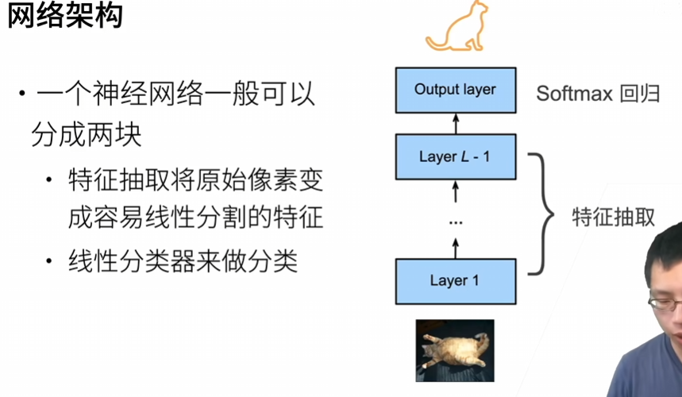
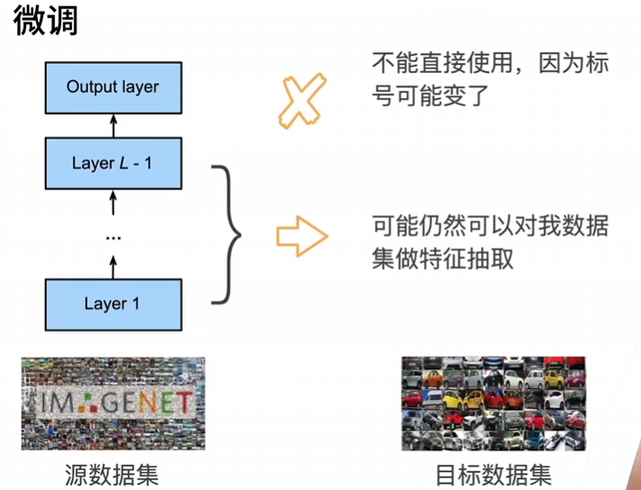
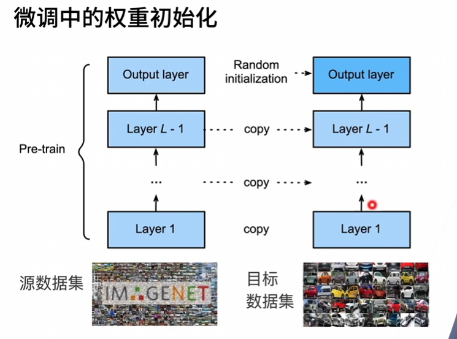
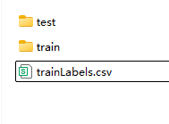

# 37.微调

[链接](https://www.bilibili.com/video/BV1Sb4y1d7CR?spm_id_from=333.788.videopod.episodes&vd_source=8924ad59b4f62224f165e16aa3d04f00&p=2)

## 37.1.微调

微调：transfer learning迁移学习

> 也有人提到fine tuning 中文也是微调，我现在还不知道它们的区别
>
> 后续补充:在QA中提到transfer Learning和fine tuning只是同一个东西的两个名字而已...





微调的核心思想：在源数据集(通常是一个比较大的数据集)上训练的模型，可以把特征提取的部分拿来在目标数据集中复用  
下图左右两边是两个模型，左边是在源数据集预训练好的模型，在右边的目标数据集上训练自己的模型的时候，选择跟预训练时相同的模型架构，然后在权重初始化时使用预训练已经得到的权重



**训练**

+ 是一个目标数据集上的正常训练任务，但使用更强的正则化
  + 使用更小的学习率
  + 使用更少的数据迭代
+ 源数据集远复杂于目标数据，通常微调效果更好

**重用分类器权重**

+ 源数据集可能也有目标数据中的部分标号
+ 可以使用预训练好模型分类器中对应标号对应的向量来做初始化

**固定一些层**

+ 神经网络通常学习有层次的特征表示
  + 低层次的特征更加通用
  + 高层次的特征则更跟数据集相关
+ 可以固定底部一些层的参数，不参与更新
  + 更强的正则

**总结**

+ 微调通过使用在大数据上得到的预训练好的模型来初始化模型权重来完成提升精度
+ 预训练模型质量很重要
+ 微调通常
+ 速度更快精度更高

## 37.2.代码

# 38.第二次竞赛 树叶分类结果

[视频链接](https://www.bilibili.com/video/BV1Eb4y1C7Fn?spm_id_from=333.788.recommend_more_video.0&trackid=web_related_0.router-related-2206146-cnt78.1763371294586.541&vd_source=8924ad59b4f62224f165e16aa3d04f00)

# 39.实战 Kaggle比赛:图像分类(CIFAR-10)

[视频链接](https://www.bilibili.com/video/BV1Gy4y1M7Cu?spm_id_from=333.788.recommend_more_video.-1&trackid=web_related_0.router-related-2206146-mbfvr.1763372350299.809&vd_source=8924ad59b4f62224f165e16aa3d04f00) ，比赛网址是 https://www.kaggle.com/c/cifar-10 这一节演示了参加一次竞赛的过程，我应该花多一点时间读代码


李沐老师准备了一份数据，在运行到下面的代码时这些数据被下载下来了，它包含三个部分：`train`目录，`test`目录，`trainLabels.csv`文件  

两个目录里就是一些图片，csv文件里有train目录中各个图片的标签

```python
d2l.DATA_HUB['cifar10_tiny'] = (d2l.DATA_URL + 'kaggle_cifar10_tiny.zip',
                               '2068874e4b9a9f0fb07ebe0ad2b29754449ccacd')
```



## 39.1.实战 图像分类

后续同级目录多出了一个`train_valied_test`目录，其中包含四个目录

+ train_valid包含所有的训练数据（训练数据被分为了训练集和验证集）
+ valid包含是验证集对应的数据
+ train包含训练集对应的数据
+ test是测试集包含的数据

这一节用到了`d2l.train_batch_ch13`其实现在`36.数据增广`的代码中

这里引入了`scheduler`，学习率调整器

在训练集训练，验证集验证之后，又在全部训练数据(训练集+验证集)上训练了一次，为什么要这样呢？之前的做法似乎是在每个epoch上把数据集随机分成若干份，其中一部分用于训练，另一部分用于验证。

## 39.2.QA

Q：`weight_decay`和`lr_decay`的区别？  
A：随着训练的进行，可以把模型权重和学习率降低；前者是模型权重降低相关的参数，后者是学习率降低相关的参数  


Q：在完整数据集跑一次的时候参数还更新么？如果不更新，这一步是不是可以省略
> 我在前面也对这个“在完整数据集跑一次”提出了疑问

A：完整数据集跑的时候是从random开始重新跑的，没有用前面训练好的东西

# 40.实战 Kaggle比赛:狗的品种识别(ImageNet Dogs)

比赛网址： https://www.kaggle.com/c/dog-breed-identification

## 40.1.实战 狗的品种识别

`train`函数里有一行`animator.add(epoch + 1, (None, valid_loss.detach()))`报错了，gpu上的Tensor不能转换为Numpy数组  
所以这一行改成了`animator.add(epoch + 1, (None, valid_loss.detach().cpu().numpy()))`


这里用到了**微调**，上一个实战好像没有用到。看看这里微调的代码细节：

```python
# 除了最后一层外，前面的层固定住参数不变
def get_net(device):
    finetune_net = nn.Sequential()
    finetune_net.features = torchvision.models.resnet34(pretrained=True)
    finetune_net.output_new = nn.Sequential(nn.Linear(1000,256),nn.ReLU(),nn.Linear(256,120))
    finetune_net = finetune_net.to(devices[0])
    for param in finetune_net.features.parameters(): # 遍历features的所有参数
        param.requires_grad = False  
    return finetune_net # 返回整个网络，这个网络中原始层的参数固定住了，保持不变
```

在`37.微调`中提到，神经网络可以分成“特征提取层”和”输出层“，这里的`.output_new`访问了输出层并把它重新赋值了  
对应的`.features`访问的就是”特征提取层“，这里的`param.requires_grad = False`使它们在反向传播时不会计算梯度，也不会更新。

## 40.2.QA


# 写在中间

连续两节的实战让我收获很大，但是我有一种奇怪的心理：代码里带d2l的地方还是让我非常不舒服，我想要**去掉d2l依赖**。虽然去掉d2l之后用一些pytorch带的框架里面的细节我也不完全清楚，但总会让我接受度强一些。  

TODO：参考kaggle上这两个竞赛的提交，把他们的代码扒下来放在我的`实战练习`里（或者直接原地修改，重点是去掉d2l依赖）


# 41.物体检测和数据集

[视频链接](https://www.bilibili.com/video/BV1Lh411Y7LX?spm_id_from=333.788.recommend_more_video.0&trackid=web_related_0.router-related-2206146-8k2m6.1763631058844.328&vd_source=8924ad59b4f62224f165e16aa3d04f00)

## 41.1.物体检测

图片分类和目标检测的区别：

前者一张图片里可能只有一个主体，认出这个主体就好了；后者一张图片里可能有若干主体，需要把这些主体全都认出来，还需要找出每个物体的位置。

**边缘框**

+ 一个边缘框可以通过4个数字定义
  + （左上x，左上y，右下x，右下y）
  + （左上x，左上y，宽，高）

**目标检测数据集**

+ 每行表示一个物体
  + 图片文件名，物体类别，边缘框
+ COCO（https://cocodataset.org/）

## 41.2.边缘框实现

演示了怎么给一张图片加上边缘框  

见`41.2.边缘框实现.ipynb`

## 41.3.数据集

这份代码很大程度去掉了`d2l`依赖  

**这里出现的框是标注出来的，还没有讲怎么做物体检测**  

见`41.3.数据集.ipynb`

# 42.锚框

[视频地址](https://www.bilibili.com/video/BV1aB4y1K7za/?spm_id_from=333.1387.upload.video_card.click&vd_source=8924ad59b4f62224f165e16aa3d04f00)

## 42.1.锚框

**锚框**

+ 一类目标检测算法是基于锚框
  + 提出多个被称为锚框的区域（边缘框）
  + 预测每个锚框是否含有关注的物体
  + 如果是，预测从这个锚框到真实边缘框的偏移

**IoU-交并比**

+ 用来计算两个框之间的相似度
  + 0表示无重叠,1表示完全重叠
  + 给定两个集合AB, $J(A,B)=\frac{|A \cap B|}{|A \cup B|}$

**赋予锚框标号**

> 图片有一些标好的边缘框，读入后会生成一些锚框。

+ 每个锚框是一个训练样本
+ 将每个锚框，要么标注成背景，要么关联上一个真实边缘框
+ 我们可能会生成大量的锚框
  + 这个导致大量的负类样本

具体怎么给锚框赋予标号（把锚框跟边缘框关联起来）？举一个具体例子：

假设图片有4个边缘框（标好的），读取图片后生成了9个锚框，这样就会有9行4列，36个IoU值，取最大的一个IoU值，把锚框和边缘框对应起来，再删除该行和该列的所有Iou值，再选取剩余的最大的IoU值...如此重复四次，每个边缘框就都有对应的锚框了。

**使用非极大值抑制（NMS）输出**

+ 每个锚框预测一个边缘框（或者标注成背景 ）
+ NMS可以合并相似的预测
  + 选中是非背景类的最大预测值
  + 去掉所有其它和它IoU值大于 $\theta$ 的预测
  + 重复上述过程直到所有预测要么被选中，要么被去掉

> 换一种描述方式：设置一个阈值，找到最大预测值对应的锚框，和这个锚框重叠程度超过阈值的全部删除，然后重复

## 42.2.代码

**关于 `torch.meshgrid`**

假设要做这么一个事：有三个向量 $A=[?,?]，B=[?,?,?],C=[?,?,?,?]$ ，要用它们组合出 $2*3*4$ 个三维点对 $A_0B_0C_0,A_0B_0C_1,A_0B_0C_2,...,A_1B_2C_3$ ，可以用`torch.mershgrid`来做这件事

```python
import torch
tensor1 = torch.tensor([6, 45])
tensor2 = torch.tensor([23, 632, 2])
tensor3 = torch.tensor([44, 43, 890, 22])
xx,yy,zz = torch.meshgrid(tensor1,tensor2,tensor3,indexing='ij')
```

`xx,yy,zz`三个张量的形状都是`(2,3,4)`，如果要获得`x`向量的第`1`个元素，`y`向量的第`1`个元素，`z`向量的第`0`个元素（只是为了理解其数据结构，这个函数不是为了这样用的）

可以这样

```python
x = xx[1][1][0] # 45
y = yy[1][1][0] # 632
z = zz[1][1][0] # 44
```

**关于计算锚框的宽度和高度**

老师给出的代码是这样的，跟前面讲述的公式不符

```python
w = torch.cat((size_tensor * torch.sqrt(ratio_tensor[0]),
               sizes[0] * torch.sqrt(ratio_tensor[1:]))) \
* in_height / in_width
h = torch.cat((size_tensor / torch.sqrt(ratio_tensor[0]),
               sizes[0] / torch.sqrt(ratio_tensor[1:])))
```

`* in_height / in_width`用于把宽高比换算到统一尺度（因为特征图可能非方形），为什么是`*height/width`？因为r是宽高比，这里w里元素的值是在x轴上占整个图片的比例(0~1)。对于同样的w值，图片宽度越宽，对应的点越往右，为了保持锚框的宽高比，应该降低w的值，因此width放在分母的位置，height同理。  

在后续代码中，这里的w乘以了图片宽度，h乘以了图片高度，因此真实宽高公式是，

**torch.cat和torch.stack**

它们都在“拼张量”，不同的是

+ torch.stack：会新增一个新维度，把输入张量沿这个新轴堆起来，要求所有输入张量shape完全一致。适合把“多份相同的数据结构”打包成一个更高维度的张量。例如把多个 `[C,H,W]` 堆成 `[N,C,H,W]`
+ torch.cat：不会新增维度，只是在已有的某个维度上把张量首尾相接。其它维度的大小必须一致。

**对torch.stack的dim参数的理解**

假设最开始有形状相同的若干张量 $A,B,C...$

如果 $dim=0$ 则前一个张量第0维遍历完后才会遍历后一个张量，第0维也就是整个张量

如果 $dim=1$ 则前一个张量每遍历完第1维，就会该遍历后一个张量的第1维，举个例子：

`A=[[1,2],[3,4]] B=[[5,6],[7,8]]` 

接下来模拟一下遍历的过程，需要提前说明的是，张量A的形状是`(2,2)`，我们认为它第0维只有一个元素，即整个张量；认为它第1维有两个元素，分别是`[1,2]`和`[3,4]`；认为它第三维有四个元素，分别是`1,2,3,4`（此处的语言极不规范，可以认为脱离于日常数学）

回到遍历的过程， $dim=1$ 的情况下，**每当第1维元素被遍历结束，就应该遍历下一个张量相同位置的元素**。因此当遍历完`[1，2]`后，应该遍历的是`[5,6]`  

故，最小元素遍历的顺序是`1,2,5,6,3,4,7,8`，结合`torch.stack([A,B],dim=1)`返回的张量形状是`(2,2,2)`可以反推得到的张量结构如下

`[[[1,2],[5,6]],[[3,4],[7,8]]]`

如果 $dim=2$ 与 $dim=1$ 同理，**每当第2维元素被遍历结束，就应该遍历下一个张量相同位置的元素**，因此当遍历完`1`后应该遍历的是`5`

故遍历顺序是`1,5,2,6,3,7,4,8`，张量形状同样是`(2,2,2)`，反推得到张量结构如下

`[[[1,5],[2,6]],[[3,7],[4,8]]]`

**torch.repeat_interleave 和 对torch.repeat_interleave的dim参数的理解**

`repeat_interleave`的作用：把所有最小元素重复若干次，并把张量展开成1维

```python
x = torch.tensor([[1,2,3],[4,5,6]])
x.repeat_interleave(2)
'''
tensor([1, 1, 2, 2, 3, 3, 4, 4, 5, 5, 6, 6])
'''
```

如果设置了`dim`参数则不会把张量展开成1维，还是拿`A=[[1,2],[3,4]]`举例，它的形状是`(2,2)`，当传入参数是2时会使某个维度的长度翻倍，当然传入3会使长度乘以3。

如果 `x.repeat_interleave(2,dim=0)` 形状变成`(4,2)`，具体结构是`A=[[1,2],[1,2],[3,4],[3,4]]`  

如果 `x.repeat_interleave(2,dim=1)` 形状变成`(2,4)`，具体结构是`A=[[1,1,2,2],[3,3,4,4]]`  

这个逻辑比较简单就不再赘述，可以注意的是，复制出来的新元素的位置都是紧挨着原本的元素的。
