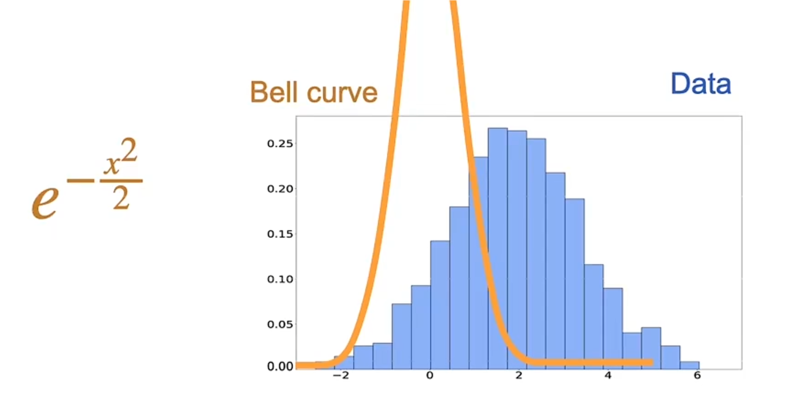
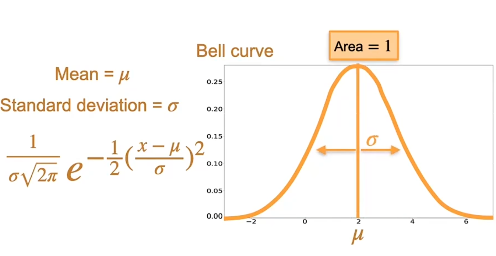

[课程地址](https://www.bilibili.com/video/BV1WH4y1q7o6?p=1&vd_source=8924ad59b4f62224f165e16aa3d04f00)

试图用曲线拟合图形

$$e^{-\frac{x^2}{2}}$$

$$\frac{1}{σ\sqrt{2\pi}}e^{-\frac{1}{2}(\frac{x-μ}{σ})^2}$$

$μ$是均值 $σ$是标准差(决定图形横向的宽度) $σ\sqrt{2\pi}$是右边e^{...}这坨的面积，除以这个值是为了使面积为1

当前进度 p44
