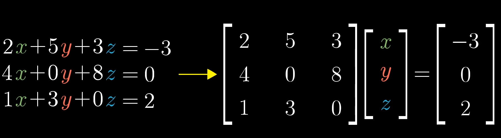
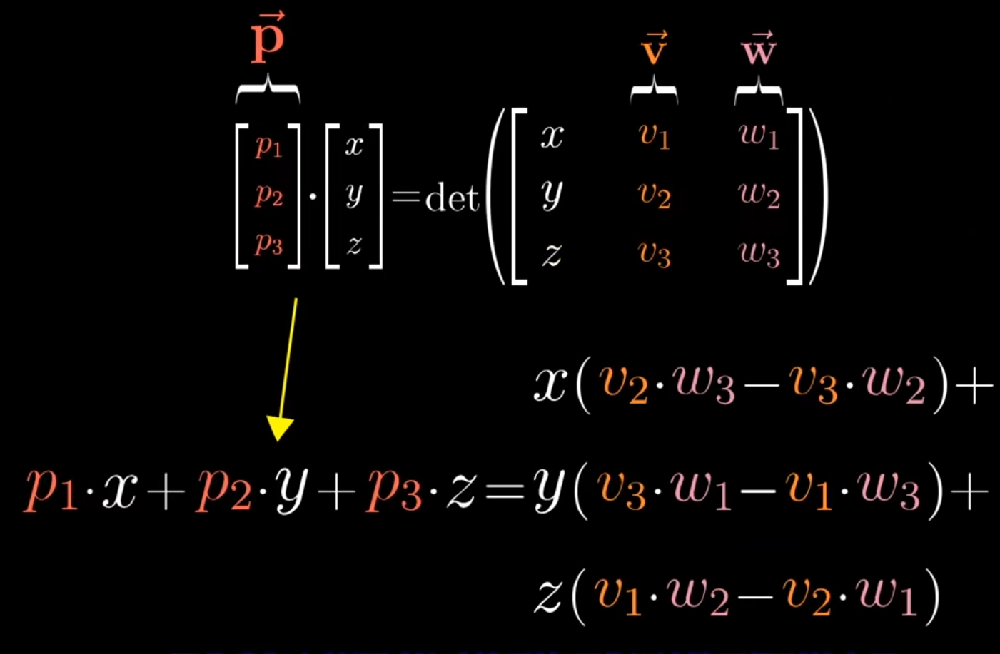

[课程链接](https://www.bilibili.com/video/BV1ys411472E/?spm_id_from=333.788.top_right_bar_window_custom_collection.content.click&vd_source=8924ad59b4f62224f165e16aa3d04f00)

# 00序言

不能通过这一系列视频学习一门完整的科目，但能形成正确的几何直观

# 01向量究竟是什么

物理视角：向量是空中的箭头，长度和方向决定了一个向量


计算机视角：向量是有序的数字列表(一维数组)


数学视角：向量可以是任何东西，只要保证两个向量**相加**以及数字与向量**相乘**有意义即可


“线性代数围绕两种基本运算：向量加法与向量数乘”

# 02线性组合、张成的空间与基

基：二维坐标系中的两个基向量是


$$
\widehat{i}(1,0)和\widehat{j}(0,1)
$$


这里的“张成”(span)，意为几个向量经过任意线性变换可以得到的空间


对于“线性相关”的解释：

```txt
你有多个向量，并且可以移除其中一个而不减小张成的空间，当发生这种情况时，我们称它是“线性相关”的。

另一个表述是其中一个向量可以表示为其它向量的线性组合，因为这个向量已经落在其它向量张成的空间之中
```


相反，如果所有向量都给张成空间增添了新的维度，它们(这一组向量)就被称为是“线性无关”的。


空间的一组基的严格定义是这样的:

```txt
张成该空间的一个线性无关向量的集合
```

# 03矩阵与线性变换

直观地说，如果一个变换具有以下两个性质，就称它是线性变换

```txt
1.直线在变换后仍然保持为直线，不能有所弯曲
1.另一个描述：原先等距分布的点，在变换后依然等距分布
2.原点必须保持固定
```


视频从几何视角通俗易懂地解释了为什么向量乘以以下矩阵 X 后会发生逆时针旋转90度的**线性变换**(在二维平面中)


$$
X=\left|
	\begin{matrix}
		0 & -1\\
		1 & 0\\
	\end{matrix}
\right|
$$


把这个矩阵看成是对基向量的变换，变换之后基向量 $\widehat{i}$ 落在了(0,1)的位置，另一个基向量 $\widehat{j}$ 落在了(-1,0)的位置

# 04矩阵乘法与线性变换复合

假设有以下两个矩阵


$$
剪切矩阵 Shear=\left|
	\begin{matrix}
		1 & 1\\
		0 & 1\\
	\end{matrix}
\right|
$$

$$
旋转矩阵 Rotation=\left|
	\begin{matrix}
		0 & -1\\
		1 & 0\\
	\end{matrix}
\right|
$$


分别记为 $S,R$ 。假设有原矩阵 $X$ ,如果要把原矩阵先旋转再剪切，进行的运算应该是 $SRX$ 。若先剪切再旋转则进行的运算是 $RSX$ 这里应该从右向左读


一种视角是把左边的符号看作函数，右边的符号看作参数。


当然，正常的运算顺序是从左向右的，但是在不改变左乘右乘关系的前提下，从右往左运算也是可以的。


强调一下，”先旋转后裁切“与”先裁切后旋转“所得到的结果是不同的。


视频证明了 $(AB)C=A(BC)$ ，但我觉得这个证明方式太”直观“了，不能被说服

# 附注1 三维空间中的线性变换

上一章只说明了一类将二维向量变换为其它二维向量的特殊变换


这里举了几个三维的例子 没有新东西

# 05 行列式

二维空间举例


有线性变换


$$
X=\left|
	\begin{matrix}
		3 & 0\\
		0 & 2\\
	\end{matrix}
\right|
$$


基向量被换成了 $(3,0)$ 和 $(0,2)$ ，之前围成的面积为1的图形，现在面积变成了6。


这个特殊的缩放比例，即线性变换改变面积的比例被称为这个变换的行列式


若一个二维线性变换的行列式为0，则说明它将整个平面压缩到一条线甚至一个点上（总之是被降维了），此时任何区域的面积都变成了0


如果行列式值为负数，相当于二维平面”被翻了一个面“，绝对值仍然意味着面积的变化比例


NxN行列式的计算：


”各条“主对角线各元素乘积之  和 减去 ”各条“副对角线各元素乘积之和


$$
A=\left|
	\begin{matrix}
		a & b & c\\
		d & e & f\\
		g & h & i\\
	\end{matrix}
\right|
$$


$det(A) = aei + bfg + cdh - ceg - bdi - afh$

# 06 逆矩阵、列空间与零空间

这一章我看了第二遍





上述方程意味着需要寻找一个向量x在经历变换A之后与向量v重合。可以将等式两边都左乘A的逆变换


只要变换A不将空间降维，即A的行列式不为0，则A的逆是存在的


当A的逆不存在时，方程也不一定无解，因为v有概率恰好在降维之后的面、线、点上。这时候要么无解，要么有无穷个解。


”所有可能的变换结果的集合被称为矩阵的列空间” 我扩充一下 “原空间经过矩阵变换后所有可能的变换结果的集合被称为矩阵的列空间”。


更精确的秩的定义是列空间的维数


经过某矩阵变换后落在原点的向量的集合被称为该矩阵的”零空间“或者”核“ 

# 附注2 非方阵

前面章节提到的变换矩阵都是方阵，即NxN的正方形矩阵。那么非方阵的含义是什么呢？


聊回方阵，2x2的矩阵变换效果是把两个基向量变换到第一列和第二列对应的向量。（因为有两列，所以变换之前的空间是二维的）


同样地，3x2的矩阵变换效果是把两个基向量变换到第一列和第二列对应的向量。但是此处第一列和第二列的向量是三维的。这样一来，就把二维空间的平面映射到三维空间中了。这个矩阵的列空间是三维空间中一个过原点的二维平面


对应地，2x3的矩阵把三维空间映射到二维平面中了。


现在回答一个问题，为什么三行四列的行列式不存在？

```txt
前面提到，行列式的几何意义是：经过对应的矩阵变换后，基向量所组成的“空间大小”的变化比例
当矩阵不是方阵时，空间的维度发生了变化，“空间大小”的变化比例就不能用一个数值来表示了
因此三行四列的行列式不存在(无法求值)是很合理的。
```

# 07点积与对偶性

点积描述的是两个规模相同的向量之间的运算，数值上的计算方式是对应位置的数相乘之后相加 $(1,2,3)*(2,3,4) = 2+6+12 = 20$


  几何上的意义是一个向量在另一个向量上投影的长度乘以另一个向量的长度


关于对偶性到底是什么，我没有理解

# 08第一部分 叉积的标准介绍

假设有两个二维向量 $v$ 和 $w$ 考虑它们张成的平行四边形  $v × w$ 正是这个平行四边形的面积


"大致来讲，如果v在w右侧，则叉乘为正，否则叉乘为负" $v × w = -w × v$


一个确定正负号的方法是 $\widehat{i} × \widehat{j} = +1$ ，基向量的顺序就是定向的基础


而下方行列式的几何意义正是如此，求值的正负关系也是对应的。


$$
A=\left|
	\begin{matrix}
		v_x & w_x\\
		v_y & w_y\\
	\end{matrix}
\right|
$$


求叉乘可以直接求A对应的行列式


**严格意义上，前面讲的东西不是叉乘。真正的叉乘是通过两个三维向量生成一个新的三维向量**


还是考虑两个向量围成的平行四边形，生成向量的长度等于平行四边形的面积。向量的方向与平行四边形垂直。


因为垂直的方向有两个，需要用到右手定则：右手食指指向v方向，中指指向w方向，大拇指竖起来就是新向量的方向。


有一个数学上的表达式可以计算叉乘得到的向量


$$
\left|
	\begin{matrix}
		v_1\\
		v_2\\
		v_3\\
	\end{matrix}
\right|
 ×
 \left|
	\begin{matrix}
		w_1\\
		w_2\\
		w_3\\
	\end{matrix}
\right|=
det( \left|
	\begin{matrix}
		\widehat{i} & v_1 & w_1\\
		\widehat{j} & v_2 & w_2\\
		\widehat{k} & v_3 & w_3\\
	\end{matrix}
\right|
)
$$


上述行列式的计算结果为 $\widehat{i}(v_2w_3-v_3w_2)+\widehat{j}(v_3w_1-v_1w_3)+\widehat{k}(v_1w_2-v_2w_1)$


这是符号上的技巧，原理和几何意义在下一章讲解

# 08第二部分 以线性变换的眼光看叉积

每当看到一个从空间到数周的线性变换，都可以找到一个向量，被称为这个变换的对偶向量，使得应用线性变换和与对偶向量点乘等价。


The plan

```txt
1.根据v和w定义一个三维到一维的线性变换
2.找到它的对偶向量
3.说明这个对偶向量就是 v × w
```


算是证明了为什么要用07第一部分提到的方式计算叉积





即 $p_1 =(v_2w_3-v_3w_2),p_2=(v_3w_1-v_1w_3),p_3=(v_1w_2-v_2w_1)$


# 09基变换

发生在向量与一组数之间的任意一种转化，都被称为一个坐标系。上文提到的 $\widehat{i}$ 和 $\widehat{j}$ 被称为我们这个标准坐标系的基向量


在此讨论使用另一组基向量而非标准基向量的思想


假设Alice有一个坐标系，原点与标准坐标系相同，其两个基向量分别为 $\widehat{b_1}$ 和 $\widehat{b_2}$ ，这两个基向量对应到标准坐标系坐标分别是 $(2,1)$ 和 $(-1,1)$


她的坐标系下的一个向量 $(-1,2)$ ，如何用标准坐标系描述这个向量呢？


记矩阵


$$
T=\left|
	\begin{matrix}
		2 & -1\\
		1 & 1\\
	\end{matrix}
\right|
$$


则答案是


$$
T
×
\left|
	\begin{matrix}
		-1\\
		2\\
	\end{matrix}
\right|=
\left|
	\begin{matrix}
		-4\\
		 1\\
	\end{matrix}
\right|
$$


反过来，标准坐标系下的一个向量 $(3,2)$ ，如何在她的坐标系下描述这个向量呢？答案是


$$
T^{-1}
×
\left|
	\begin{matrix}
		3\\
		2\\
	\end{matrix}
\right|=
\left|
	\begin{matrix}
		5/3\\
		 1/3\\
	\end{matrix}
\right|
$$


顺便一提


$$
T^{-1}=
\left|
	\begin{matrix}
		1/3 & 1/3\\
		 -1/3 & 2/3\\
	\end{matrix}
\right|
$$


在Alice的坐标系如何描述一个向量 $V$ 逆时针旋转了90度？（注意这个向量是用Alice坐标系描述的）答案是


$$
T^{-1}
\left|
	\begin{matrix}
		 0 & -1\\
		 1 & 0\\
	\end{matrix}
\right|
TV
$$

从右往左看，先将V向量转换到标准坐标系的描述(左乘 $T$ )，再逆时针旋转90度(左乘旋转矩阵)，再转换到Alice坐标系的描述(左乘 $T^{-1}$ )


总的来说，当看到这样一个表达式 $A^{-1}MA$ ，它代表“某种变换的视角转换”


# 10特征向量与特征值

经历一个线性变换后，有的向量仍然留在其张成的直线中(相当于只进行了伸缩变换，而没有任何旋转)，这些特殊向量被称为变换的“**特征向量**”


每个特征向量都有一个所属的值被称为“**特征值**”，衡量特征向量在变换中拉伸或压缩的比例


基于上面两句话，对于某一变换矩阵的特征向量来说，经历这个矩阵变换相当于数乘了某个值，因此有等式


$$
A \vec{v} = \lambda \vec{v}
$$


其中 $A$ 是变换矩阵， $\vec{v}$ 是特征向量， $\lambda$ 是对应的特征值，根据此得出求特征值的等式


$$
(A - \lambda I) \vec{v} = \vec{0}
$$


(把等式右边写成矩阵乘以向量的形式是 $\lambda I  \vec{v}$  其中 $I$ 是单位阵)


$$
I =\left|
	\begin{matrix}
		1 & 0 & \cdots & 0\\
		0 & 1 & \cdots & 0\\
		\vdots & \vdots & \ddots & \vdots \\
		0 & 0 & \cdots & 1\\
	\end{matrix}
\right|
$$


根据前面的章节，当且仅当变换矩阵将空间压缩到更低维度时，才会存在一个非零向量使得矩阵和它的乘积为零向量。且将空间压缩到更低维度的变换矩阵的行列式值为0。因此可以得到矩阵 $A - \lambda I$ 对应的行列式值为0的方程，由此可以得出特征值。


如果方程有解，就有特征值了。将不同特征值代入上述等式可得对应的特征向量。


## 特征基

看看如果基向量都是特征向量，会发生什么事情，例如下列变换矩阵


$$
\left|
	\begin{matrix}
	-1 & 0\\
	0 & 2\\
	\end{matrix}
\right|
$$


变换后 $\hat{i}$ 变为 $(-1,0)$ , $\hat{j}$ 变为 $(0,2)$ ，它们都是特征向量，且各自的特征值都在变换矩阵的对角线上，分别是 $-1$ 和 $2$ 。且矩阵其它元素均为0。


除了对角元其它元素均为0的矩阵被称为对角矩阵很合理，经过这样的矩阵变换所有的基向量都变为特征向量，特征值是对角线上对应的元素值。对角矩阵在很多方面都更容易处理，例如多次与自己相乘。（显然可以矩阵快速幂加速）


**我突然发现“经过矩阵变换所有的基向量都变为特征向量”与“基向量就是特征向量”这两个描述是等价的。举例解释：变换前有向量v1(0.5,0)和v2(1,0)，变换后有向量V1(1,0)和V2(2,0)。变换后的基向量是V1，它是特征向量。而V2是由变换前的基向量变换而来的，也是特征向量**


但是基向量同是特征向量的概率较小，还有没有别的情况可以使用对角阵运算方便的特性？有的。


如果特征向量可以张成全空间的集合，那么可以使用第九章提到过的基变换。取用若干特征向量作为新的基向量，在这个新的坐标系中表达旧坐标系中描述的变换。


举个例子，对于变换


$$
A=\left|
	\begin{matrix}
	3 & 1\\
	0 & 2\\
	\end{matrix}
\right|
$$


有两个特征向量 $(1,0)$ 和 $(-1,1)$


记这两个向量组成的矩阵


$$
T=\left|
	\begin{matrix}
	1 & -1\\
	0 & 1\\
	\end{matrix}
\right|
$$


那么如果在新的坐标系中表达变换A，其形式应为


$$
T^{-1}AT=\left|
	\begin{matrix}
	3 & 0\\
	0 & 2\\
	\end{matrix}
\right|
$$


得到的矩阵必然为一个对角阵。因此如果要计算 $A$ 的 $100$ 次方，可以转换到新坐标系下完成计算，再将计算结果转换回标准坐标系。**转换的具体细节在第九章有详细笔记**


特征基：一组基向量（同样是特征向量）构成的集合。


**视频结尾有一道练习题**


# 11抽象向量空间

什么是向量

有一个包含8条内容的check list

“普适的代价是抽象”

# 矩阵markdown 举例


$$
X=\left|
	\begin{matrix}
	x_{11} & \cdots & x_{1n}\\
	\vdots & \ddots & \vdots \\
	x_{n1} & \cdots & x_{nn}\\
	\end{matrix}
\right|
$$
