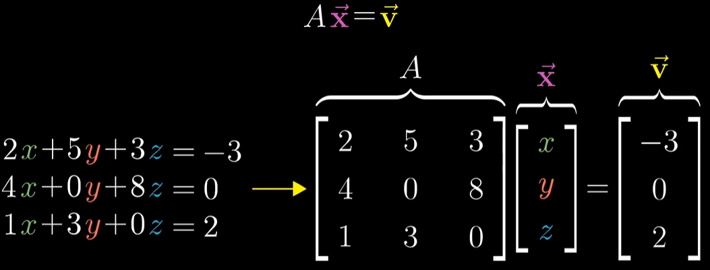

[课程链接](https://www.bilibili.com/video/BV1ys411472E/?spm_id_from=333.788.top_right_bar_window_custom_collection.content.click&vd_source=8924ad59b4f62224f165e16aa3d04f00)

# 00序言

不能通过这一系列视频学习一门完整的科目，但能形成正确的几何直观

# 01向量究竟是什么

物理视角：向量是空中的箭头，长度和方向决定了一个向量


计算机视角：向量是有序的数字列表(一维数组)


数学视角：向量可以是任何东西，只要保证两个向量**相加**以及数字与向量**相乘**有意义即可


“线性代数围绕两种基本运算：向量加法与向量数成”

# 02线性组合、张成的空间与基

基：二维坐标系中的两个基向量是


$$
\widehat{i}(1,0)和\widehat{j}(0,1)
$$


这里的“张成”(span)，意为几个向量经过任意线性变换可以得到的空间


对于“线性相关”的解释：

```txt
你有多个向量，并且可以移除其中一个而不减小张成的空间，当发生这种情况时，我们称它是“线性相关”的。

另一个表述是其中一个向量可以表示为其它向量的线性组合，因为这个向量已经落在其它向量张成的空间之中
```


相反，如果所有向量都给张成空间增添了新的维度，它们(这一组向量)就被称为是“线性无关”的。


空间的一组基的严格定义是这样的:

```txt
张成该空间的一个线性无关向量的集合
```

# 03矩阵与线性变换

直观地说，如果一个变换具有以下两个性质，就称它是线性变换

```txt
1.直线在变换后仍然保持为直线，不能有所弯曲
2.原点必须保持固定
```


视频从几何视角通俗易懂地解释了为什么向量乘以以下矩阵 X 后会发生逆时针旋转90度的**线性变换**(在二维平面中)


$$
X=\left|
	\begin{matrix}
		0 & -1\\
		1 & 0\\
	\end{matrix}
\right|
$$


把这个矩阵看成是对基向量的变换，变换之后基向量 $\widehat{i}$ 落在了(0,1)的位置，另一个基向量 $\widehat{j}$ 落在了(-1,0)的位置

# 04矩阵乘法与线性变换复合

假设有以下两个矩阵


$$
剪切矩阵 Shear=\left|
	\begin{matrix}
		1 & 1\\
		0 & 1\\
	\end{matrix}
\right|
$$

$$
旋转矩阵 Rotation=\left|
	\begin{matrix}
		0 & -1\\
		1 & 0\\
	\end{matrix}
\right|
$$


分别记为 $S,R$ 。假设有原矩阵 $X$ ,如果要把原矩阵先旋转再剪切，进行的运算应该是 $SRX$ 。若先剪切再旋转则进行的运算是 $RSX$ 这里应该从右向左读


一种视角是把左边的符号看作函数，右边的符号看作参数。


当然，正常的运算顺序是从左向右的，但是在不改变左乘右乘关系的前提下，从右往左运算也是可以的。


强调一下，”先旋转后裁切“与”先裁切后旋转“所得到的结果是不同的。


视频证明了 $(AB)C=A(BC)$ ，但我觉得这个证明方式太”直观“了，不能被说服

# 附注1 三维空间中的线性变换

上一章只说明了一类将二维向量变换为其它二维向量的特殊变换


这里举了几个三维的例子 没有新东西

# 05 行列式

二维空间举例


有线性变换


$$
X=\left|
	\begin{matrix}
		3 & 0\\
		0 & 2\\
	\end{matrix}
\right|
$$


基向量被换成了 $(3,0)$ 和 $(0,2)$ ，之前围成的面积为1的图形，现在面积变成了6。


这个特殊的缩放比例，即线性变换改变面积的比例被称为这个变换的行列式


若一个二维线性变换的行列式为0，则说明它将整个平面压缩到一条线甚至一个点上（总之是被降维了），此时任何区域的面积都变成了0


如果行列式值为负数，相当于二维平面”被翻了一个面“，绝对值仍然意味着面积的变化比例


NxN行列式的计算：


”各条“主对角线各元素乘积之和 减去 ”各条“副对角线各元素乘积之和


$$
A=\left|
	\begin{matrix}
		a & b & c\\
		d & e & f\\
		g & h & i\\
	\end{matrix}
\right|
$$


$det(A) = aei + bfg + cdh - ceg - bdi - afh$

# 06 逆矩阵、列空间与零空间

这一章我看了第二遍





上述方程意味着需要寻找一个向量x在经历变换A之后与向量v重合。可以将等式两边都左乘A的逆变换


只要变换A不将空间降维，即A的行列式不为0，则A的逆是存在的


当A的逆不存在时，方程也不一定无解，因为v有概率恰好在降维之后的面、线、点上。这时候要么无解，要么有无穷个解。


”所有可能的变换结果的集合被称为矩阵的列空间” 我扩充一下 “原空间经过矩阵变换后所有可能的变换结果的集合被称为矩阵的列空间”。


更精确的秩的定义是列空间的维数


经过某矩阵变换后落在原点的向量的集合被称为该矩阵的”零空间“或者”核“ 

# 附注2 非方阵

前面章节提到的变换矩阵都是方阵，即NxN的正方形矩阵。那么非方阵的含义是什么呢？


聊回方阵，2x2的矩阵变换效果是把两个基向量变换到第一列和第二列对应的向量。（因为有两列，所以变换之前的空间是二维的）


同样地，3x2的矩阵变换效果是把两个基向量变换到第一列和第二列对应的向量。但是此处第一列和第二列的向量是三维的。这样一来，就把二维空间的平面映射到三维空间中了。这个矩阵的列空间是三维空间中一个过原点的二维平面


对应地，2x3的矩阵把三维空间映射到二维平面中了。


现在回答一个问题，为什么三行四列的行列式不存在？

```txt
前面提到，行列式的几何意义是：经过对应的矩阵变换后，基向量所组成的“空间大小”的变化比例
当矩阵不是方阵时，空间的维度发生了变化，“空间大小”的变化比例就不能用一个数值来表示了
因此三行四列的表达式不存在(无法求值)是很合理的。
```

# 07点积与对偶性


# 矩阵markdown 举例

$$
X=\left|
	\begin{matrix}
		x_{11} & x_{12} & \cdots & x_{1n}\\
		x_{21} & x_{22} & \cdots & x_{2n}\\
		\vdots & \vdots & \ddots & \vdots \\
		x_{11} & x_{12} & \cdots & x_{1n}\\
	\end{matrix}
\right|
$$

