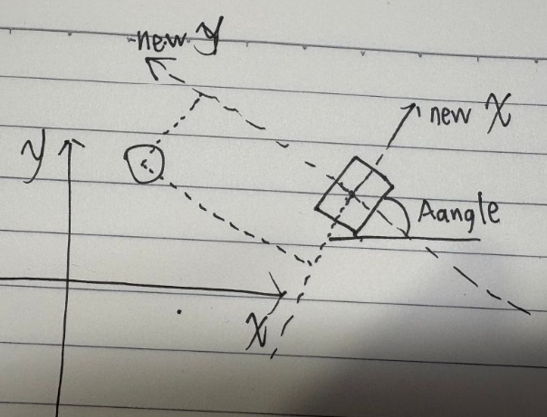
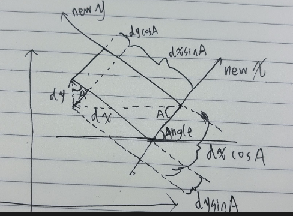

```cpp
std::clamp(value, min, max);//作用是把 value限制在min到max范围内，比min小则为min，比max大则为max
```

# 1.矩形无旋转

```cpp
#include <algorithm>

bool circleRectCollision(float cx, float cy, float r,
                         float rx, float ry, float rw, float rh)
{
    //cx cy r是圆心坐标和半径
    //rx ry是矩形中心坐标 rw rh是矩形宽和高
    float closestX = std::clamp(cx, rx-rw/2, rx + rw/2);
    float closestY = std::clamp(cy, ry-rh/2, ry + rh/2);

    float dx = cx - closestX;
    float dy = cy - closestY;

    return (dx * dx + dy * dy) <= (r * r);
}
```

# 2.矩形有旋转

有圆和矩形，矩形逆时针旋转了`Angle`度，`newX`和`newY`是新使用的坐标系，圆心在新坐标系的坐标是虚线矩形两边的长度



根据下图，`{localX,localY}`的值应该是`{dxcosA-dysinA,dycosA+dxsinA}`



```cpp
#include <cmath>
#include <algorithm>

bool circleVsRotatedRect(float cx, float cy, float r,
                         float rx, float ry,
                         float rw, float rh,
                         float angle)
{
    // 1. 圆心转到矩形中心坐标 计算圆心相对坐标
    float dx = cx - rx;
    float dy = cy - ry;


    float cosA = std::cos(angle);
    float sinA = std::sin(angle);

    float localX =  dx * cosA - dy * sinA;
    float localY =  dx * sinA + dy * cosA;

    // 2. 在本地坐标系下做 AABB 检测
    rw = rw / 2
	rh = rh / 2
    float closestX = std::clamp(localX, -rw, rw);
    float closestY = std::clamp(localY, -rh, rh);

    float diffX = localX - closestX;
    float diffY = localY - closestY;

    return (diffX * diffX + diffY * diffY) <= r * r;
}

```

